# Frequently Asked Questions

## 1. Questions regarding distributions

### 1.1. How do I know the root name of a distribution?

The root name of a probability distribution is the `name` which is used
the `d`, `p`, `q`, `r` functions. For base R distributions, the root
names are given in R-intro :
<https://cran.r-project.org/doc/manuals/R-intro.html#Probability-distributions>.
For example, you must use `"pois"` for the Poisson distribution and
**not** `"poisson"`.

### 1.2. How do I find “non standard” distributions?

For non-standard distributions, you can either find a package
implementing them or define by yourself. A comprehensive list of
non-standard distributions is given in the Distributions task view
<https://CRAN.R-project.org/view=Distributions>. Here are some two
examples of user-defined distributions. A third example (shifted
exponential) is given in FAQ 3.5.4.

- The Gumbel distribution

``` r
dgumbel <- function(x, a, b) 1/b*exp((a-x)/b)*exp(-exp((a-x)/b))
pgumbel <- function(q, a, b) exp(-exp((a-q)/b))
qgumbel <- function(p, a, b) a-b*log(-log(p))
data(groundbeef)
fitgumbel <- fitdist(groundbeef$serving, "gumbel", start=list(a=10, b=10))
```

- The zero-modified geometric distribution

``` r
dzmgeom <- function(x, p1, p2) p1 * (x == 0) + (1-p1)*dgeom(x-1, p2)
pzmgeom <- function(q, p1, p2) p1 * (q >= 0) + (1-p1)*pgeom(q-1, p2)
rzmgeom <- function(n, p1, p2) 
{
  u <- rbinom(n, 1, 1-p1) #prob to get zero is p1
  u[u != 0] <- rgeom(sum(u != 0), p2)+1
  u
}
x2 <- rzmgeom(1000, 1/2, 1/10)
fitdist(x2, "zmgeom", start=list(p1=1/2, p2=1/2))
```

### 1.3. How do I set (or find) initial values for non standard distributions?

As documented, we provide initial values for the following
distributions: `"norm"`, `"lnorm"`, `"exp"`, `"pois"`, `"cauchy"`,
`"gamma`“, `"logis"`, `"nbinom"`, `"geom"`, `"beta"`, `"weibull"` from
the `stats` package; all distributions (except phase-type distributions)
from the `actuar` package.

Look first at statistics and probability books such as

- different volumes of N. L. Johnson, S. Kotz and N. Balakrishnan books,
  e.g. **Continuous Univariate Distributions, Vol. 1**,  
- **Thesaurus of univariate discrete probability distributions** by G.
  Wimmer and G. Altmann.  
- **Statistical Distributions** by M. Evans, N. Hastings, B. Peacock.  
- **Distributional Analysis with L-moment Statistics using the R
  Environment for Statistical Computing** by W. Asquith.

If not available, find initial values by equalling theoretical and
empirical quartiles. The graphical function
[`plotdist()`](https://lbbe-software.github.io/fitdistrplus/reference/plotdist.md)
and
[`plotdistcens()`](https://lbbe-software.github.io/fitdistrplus/reference/plotdistcens.md)
can also be used to assess the suitability of starting values : by an
iterative manual process you can move parameter values so as to obtain a
distribution that roughly fits the data and take these parameter values
as starting values for the real fit. You may also consider the
[`prefit()`](https://lbbe-software.github.io/fitdistrplus/reference/prefit.md)
function to find initial values especially in case where parameters are
constrained.

### 1.4. Is it possible to fit a distribution with at least 3 parameters?

Yes, an example with the Burr distribution is detailed in the JSS paper.
We reproduce it very quickly here.

``` r
data("endosulfan")
require("actuar")
fendo.B <- fitdist(endosulfan$ATV, "burr", start = list(shape1 = 0.3, 
                                                        shape2 = 1, rate = 1))
summary(fendo.B)
```

    ## Fitting of the distribution ' burr ' by maximum likelihood 
    ## Parameters : 
    ##        estimate Std. Error
    ## shape1    0.206     0.0561
    ## shape2    1.540     0.3188
    ## rate      1.497     0.4683
    ## Loglikelihood:  -520   AIC:  1046   BIC:  1054 
    ## Correlation matrix:
    ##        shape1 shape2   rate
    ## shape1  1.000 -0.900 -0.727
    ## shape2 -0.900  1.000  0.588
    ## rate   -0.727  0.588  1.000

### 1.5. Why there are differences between MLE and MME for the lognormal distribution?

We recall that the lognormal distribution function is given by
$$F_{X}(x) = \Phi\left( \frac{\log(x) - \mu}{\sigma} \right),$$

where $\Phi$ denotes the distribution function of the standard normal
distribution. We know that
$E(X) = \exp\left( \mu + \frac{1}{2}\sigma^{2} \right)$ and
$Var(X) = \exp\left( 2\mu + \sigma^{2} \right)\left( e^{\sigma^{2}} - 1 \right)$.
The MME is obtained by inverting the previous formulas, whereas the MLE
has the following explicit solution

$${\widehat{\mu}}_{MLE} = \frac{1}{n}\sum\limits_{i = 1}^{n}\log\left( x_{i} \right),\ \ {\widehat{\sigma}}_{MLE}^{2} = \frac{1}{n}\sum\limits_{i = 1}^{n}\left( \log\left( x_{i} \right) - {\widehat{\mu}}_{MLE} \right)^{2}.$$

Let us fit a sample by MLE and MME. The fit looks particularly good in
both cases.

``` r
x3 <- rlnorm(1000)
f1 <- fitdist(x3, "lnorm", method="mle") 
f2 <- fitdist(x3, "lnorm", method="mme")
par(mfrow=1:2, mar=c(4,4,2,1))
cdfcomp(list(f1, f2), do.points=FALSE, xlogscale = TRUE, main = "CDF plot")
denscomp(list(f1, f2), demp=TRUE, main = "Density plot")
```


Let us compare the theoretical moments (mean and variance) given the
fitted values

($\widehat{\mu},\widehat{\sigma}$), that is
$$E(X) = \exp\left( \widehat{\mu} + \frac{1}{2}{\widehat{\sigma}}^{2} \right),Var(X) = \exp\left( 2\widehat{\mu} + {\widehat{\sigma}}^{2} \right)\left( e^{{\widehat{\sigma}}^{2}} - 1 \right).$$

``` r
c("E(X) by MME"=as.numeric(exp(f2$estimate["meanlog"]+f2$estimate["sdlog"]^2/2)), 
    "E(X) by MLE"=as.numeric(exp(f1$estimate["meanlog"]+f1$estimate["sdlog"]^2/2)), 
    "empirical"=mean(x3))
```

    ## E(X) by MME E(X) by MLE   empirical 
    ##        1.67        1.66        1.67

``` r
c("Var(X) by MME"=as.numeric(exp(2*f2$estimate["meanlog"]+f2$estimate["sdlog"]^2) * 
                               (exp(f2$estimate["sdlog"]^2)-1)), 
    "Var(X) by MLE"=as.numeric(exp(2*f1$estimate["meanlog"]+f1$estimate["sdlog"]^2) * 
                                 (exp(f1$estimate["sdlog"]^2)-1)), 
    "empirical"=var(x3))
```

    ## Var(X) by MME Var(X) by MLE     empirical 
    ##          4.45          4.61          4.45

From a MLE point of view, a lognormal sample $x_{1},\ldots,x_{n}$ is
equivalent to handle a normal sample
$\log\left( x_{1} \right),\ldots,\log\left( x_{n} \right)$. However, it
is well know by the Jensen inequality that
$E(X) = E\left( \exp\left( \log(X) \right) \right) \geq \exp\left( E\left( \log(X) \right) \right)$
implying the MME estimates provides better moment estimates than with
MLE.

### 1.6. Can I fit a distribution with positive support when data contains negative values?

The answer is no: you cannot fit a distribution with positive support
(say gamma distribution) when data contains negative values.

``` r
x <- rnorm(100, mean = 1, sd = 0.5)
(try(fitdist(x, "exp")))
```

    ## Error in computing default starting values.
    ## Error in manageparam(start.arg = start, fix.arg = fix.arg, obs = data,  : 
    ##   Error in startarg_transgamma_family(x, distr) : 
    ##   values must be positive to fit an exponential distribution

    ## [1] "Error in manageparam(start.arg = start, fix.arg = fix.arg, obs = data,  : \n  Error in startarg_transgamma_family(x, distr) : \n  values must be positive to fit an exponential distribution\n\n"
    ## attr(,"class")
    ## [1] "try-error"
    ## attr(,"condition")
    ## <simpleError in manageparam(start.arg = start, fix.arg = fix.arg, obs = data,     distname = distname): Error in startarg_transgamma_family(x, distr) : 
    ##   values must be positive to fit an exponential distribution
    ## >

It is irrelevant to do such fit. If you really need to use that
distribution, you have two options: either to remove negative values
(not recommended) or to shift the data.

``` r
fitdist(x[x >= 0], "exp")
```

    ## Fitting of the distribution ' exp ' by maximum likelihood 
    ## Parameters:
    ##      estimate Std. Error
    ## rate    0.921      0.093

``` r
fitdist(x - min(x), "exp")
```

    ## Fitting of the distribution ' exp ' by maximum likelihood 
    ## Parameters:
    ##      estimate Std. Error
    ## rate    0.749     0.0749

### 1.7. Can I fit a finite-support distribution when data is outside that support?

The answer is no: you cannot fit a distribution with finite-support (say
beta distribution) when data is outside $\lbrack 0,1\rbrack$.

``` r
x <- rnorm(100, mean = 0.5, sd = 0.25)
(try(fitdist(x, "beta")))
```

    ## Error in computing default starting values.
    ## Error in manageparam(start.arg = start, fix.arg = fix.arg, obs = data,  : 
    ##   Error in startargdefault(obs, distname) : 
    ##   values must be in [0-1] to fit a beta distribution

    ## [1] "Error in manageparam(start.arg = start, fix.arg = fix.arg, obs = data,  : \n  Error in startargdefault(obs, distname) : \n  values must be in [0-1] to fit a beta distribution\n\n"
    ## attr(,"class")
    ## [1] "try-error"
    ## attr(,"condition")
    ## <simpleError in manageparam(start.arg = start, fix.arg = fix.arg, obs = data,     distname = distname): Error in startargdefault(obs, distname) : 
    ##   values must be in [0-1] to fit a beta distribution
    ## >

It is irrelevant to do such a fit. If you really need to use that
distribution, you have two ways to tackle this issue: either to remove
impossible values (not recommended) or to shift/scale the data.

``` r
fitdist(x[x > 0 & x < 1], "beta")
```

    ## Fitting of the distribution ' beta ' by maximum likelihood 
    ## Parameters:
    ##        estimate Std. Error
    ## shape1     2.53      0.355
    ## shape2     2.65      0.374

``` r
fitdist((x - min(x)*1.01) / (max(x) * 1.01 - min(x) * 1.01), "beta")
```

    ## Fitting of the distribution ' beta ' by maximum likelihood 
    ## Parameters:
    ##        estimate Std. Error
    ## shape1     1.83      0.243
    ## shape2     2.73      0.377

### 1.8. Can I fit truncated distributions?

The answer is yes: but the fitting procedure must be carried out
carefully. Let $X$ be the original untruncated random variable. The
truncated variable is the conditionnal random variable
$Y = X\ |\ l < X < u$ with $l < u$ the lower and upper bounds. The cdf
of $Y$ is $F_{Y}(y) = \frac{F_{X}(x) - F_{X}(l)}{F_{X}(u) - F_{X}(l)}$.
There is a density (w.r.t. the Lebesgues measure) given by
$$f_{Y}(y) = \begin{cases}
\frac{f_{X}(x)}{F_{X}(u) - F_{X}(l)} & {{\text{if}\mspace{6mu}}l < x < u} \\
0 & {\text{otherwise}\mspace{6mu}} \\
 & 
\end{cases}$$

``` r
dtexp <- function(x, rate, low, upp)
{
  PU <- pexp(upp, rate=rate)
  PL <- pexp(low, rate=rate)
  dexp(x, rate) / (PU-PL) * (x >= low) * (x <= upp) 
}
ptexp <- function(q, rate, low, upp)
{
  PU <- pexp(upp, rate=rate)
  PL <- pexp(low, rate=rate)
  (pexp(q, rate)-PL) / (PU-PL) * (q >= low) * (q <= upp) + 1 * (q > upp)
}
n <- 200
x <- rexp(n); x <- x[x > .5 & x < 3]
f1 <- fitdist(x, "texp", method="mle", start=list(rate=3), 
              fix.arg=list(low=min(x), upp=max(x)))
f2 <- fitdist(x, "texp", method="mle", start=list(rate=3), 
              fix.arg=list(low=.5, upp=3))
gofstat(list(f1, f2))
```

    ## Goodness-of-fit statistics
    ##                              1-mle-texp 2-mle-texp
    ## Kolmogorov-Smirnov statistic     0.0354     0.0395
    ## Cramer-von Mises statistic       0.0268     0.0276
    ## Anderson-Darling statistic          Inf     0.1900
    ## 
    ## Goodness-of-fit criteria
    ##                                1-mle-texp 2-mle-texp
    ## Akaike's Information Criterion        157        160
    ## Bayesian Information Criterion        160        163

``` r
par(mfrow=c(1,1), mar=c(4,4,2,1))
cdfcomp(list(f1, f2), do.points = FALSE, xlim=c(0, 3.5))
```

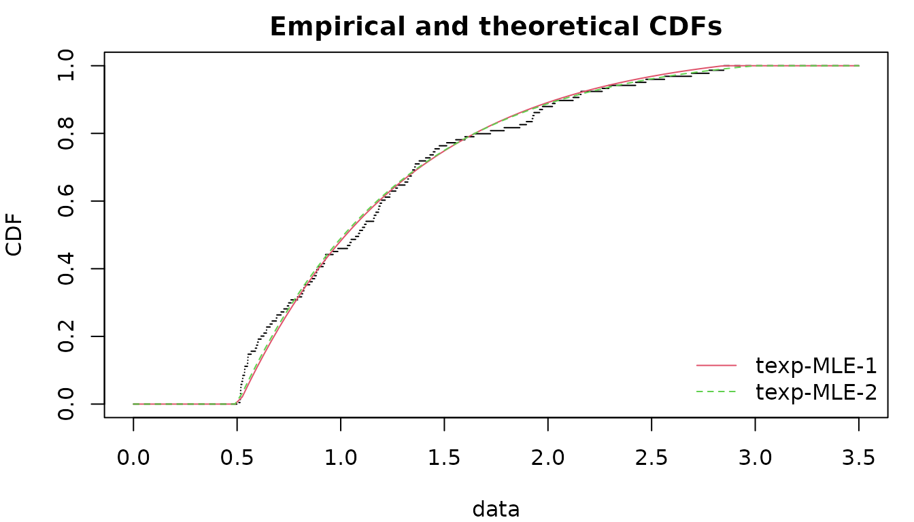

### 1.9. Can I fit truncated inflated distributions?

The answer is yes: but the fitting procedure must be carried out
carefully. Let $X$ be the original untruncated random variable. The
truncated variable is $Y = \max\left( \min(X,u),l \right)$ with $l < u$
the lower and upper bounds. The cdf of $Y$ is
$F_{Y}(y) = F_{X}(y)1_{u > y > l} + 1_{y > u}$. There is no density
(w.r.t. the Lebesgues measure) since there are two probability masses
$P(Y = l) = P(X \leq l) > 0$ and $P(Y = u) = P(X > u) > 0$. However, the
density function with respect to the measure
$m(x) = \delta_{l}(x) + \delta_{u}(x) + \lambda(x)$ is
$$f_{Y}(y) = \begin{cases}
{F_{X}(l)} & {{\text{if}\mspace{6mu}}y = l} \\
{f_{X}(y)} & {{\text{if}\mspace{6mu}}l < y < u} \\
{1 - F_{X}(u)} & {{\text{if}\mspace{6mu}}y = u} \\
 & 
\end{cases}$$ Let $\theta$ be the parameter of the untruncated
distribution. Since the likelihood can be factorized, the maximization
can be done separately
$$L(l,\theta,u) = 1_{\forall i,l \leq y_{i} \leq u}\prod\limits_{i = 1,y_{i} = l}^{n}F_{X}(l,\theta) \times \prod\limits_{i = 1,l < y_{i} < u}^{n}f_{X}\left( y_{i},\theta \right) \times \prod\limits_{i = 1,y_{i} = u}^{n}\left( 1 - F_{X}(u,\theta) \right),$$
Furthermore, using
$\left. \forall i,l \leq y_{i} \leq u\Leftrightarrow l \leq \min_{i}y_{i} \leq \max_{i}y_{i} \leq u \right.$,
the likelihood is zero for $l > \min_{i}y_{i}$ or $u < \max_{i}y_{i}$
and increasing with respect to $l$ in
$\rbrack - \infty,\min_{i}y_{i}\rbrack$ and decreasing with respect to
$u$ in $\lbrack\max_{i}y_{i}, + \infty\lbrack$. So the maximum of $L$ is
reached at $l = \min_{i}y_{i}$ and $u = \max_{i}y_{i}$. The MLE of
$\theta$ is then obtained by maximizing the log-likelihood
$\log\left( L(l,\theta,u) \right)$ with $u = \max_{i}Y_{i}$ and
$l = \min_{i}Y_{i}$.

Let us illustrate truncated distribution with the truncated exponential
distribution. The log-likelihood is particularly bad-shaped.

``` r
dtiexp <- function(x, rate, low, upp)
{
  PU <- pexp(upp, rate=rate, lower.tail = FALSE)
  PL <- pexp(low, rate=rate)
  dexp(x, rate) * (x >= low) * (x <= upp) + PL * (x == low) + PU * (x == upp)
}
ptiexp <- function(q, rate, low, upp)
  pexp(q, rate) * (q >= low) * (q <= upp) + 1 * (q > upp)
n <- 100; x <- pmax(pmin(rexp(n), 3), .5)
# the loglikelihood has a discontinous point at the solution
par(mar=c(4,4,2,1), mfrow=1:2)
llcurve(x, "tiexp", plot.arg="low", fix.arg = list(rate=2, upp=5), 
        min.arg=0, max.arg=.5, lseq=200)
llcurve(x, "tiexp", plot.arg="upp", fix.arg = list(rate=2, low=0), 
        min.arg=3, max.arg=4, lseq=200)
```


The first method directly maximizes the log-likelihood $L(l,\theta,u)$;
the second method maximizes the log-likelihood $L(\theta)$ assuming that
$u = \widehat{u}$ and $l = \widehat{l}$ are known. Inside
$\lbrack 0.5,3\rbrack$, the CDF are correctly estimated in both methods
but the first method does not succeed to estimate the true value of the
bounds $l,u$.

``` r
(f1 <- fitdist(x, "tiexp", method="mle", start=list(rate=3, low=0, upp=20)))
```

    ## Fitting of the distribution ' tiexp ' by maximum likelihood 
    ## Parameters:
    ##      estimate
    ## rate     1.07
    ## low     -0.65
    ## upp     23.52

``` r
(f2 <- fitdist(x, "tiexp", method="mle", start=list(rate=3), 
               fix.arg=list(low=min(x), upp=max(x))))
```

    ## Fitting of the distribution ' tiexp ' by maximum likelihood 
    ## Parameters:
    ##      estimate Std. Error
    ## rate      1.1      0.114
    ## Fixed parameters:
    ##     value
    ## low   0.5
    ## upp   3.0

``` r
gofstat(list(f1, f2))
```

    ## Goodness-of-fit statistics
    ##                              1-mle-tiexp 2-mle-tiexp
    ## Kolmogorov-Smirnov statistic       0.414       0.424
    ## Cramer-von Mises statistic         2.651       2.767
    ## Anderson-Darling statistic        13.358      13.818
    ## 
    ## Goodness-of-fit criteria
    ##                                1-mle-tiexp 2-mle-tiexp
    ## Akaike's Information Criterion         193         128
    ## Bayesian Information Criterion         201         131

``` r
par(mfrow=c(1,1), mar=c(4,4,2,1))
cdfcomp(list(f1, f2), do.points = FALSE, addlegend=FALSE, xlim=c(0, 3.5))
curve(ptiexp(x, 1, .5, 3), add=TRUE, col="blue", lty=3)
legend("bottomright", lty=1:3, col=c("red", "green", "blue", "black"), 
        legend=c("full MLE", "MLE fixed arg", "true CDF", "emp. CDF"))
```


### 1.10. Can I fit a uniform distribution?

The uniform distribution $\mathcal{U}(a,b)$ has only support parameters
since the density does not have a scale or a shape parameter
$f_{U}(u) = \frac{1}{b - a}1_{\lbrack a,b\rbrack}(u)$. For this
distribution, we should not maximize the log-likelihood but only the
likelihood. Let $\left( x_{i} \right)_{i}$ be i.i.d. observations from
$\mathcal{U}(a,b)$ distribution. The likelihood is
$$L(a,b) = \prod\limits_{i = 1}^{n}\frac{1}{b - a}1_{\lbrack a,b\rbrack}\left( x_{i} \right) = 1_{a \leq x_{i} \leq b,i = 1,\ldots,n}\frac{1}{b - a}^{n} = 1_{a \leq \min\limits_{i}x_{i}}1_{\max\limits_{i}x_{i} \leq b}\frac{1}{b - a}^{n}$$
Hence $\left. a\mapsto L(a,b) \right.$ for any fixed
$b \in \rbrack\max_{i}x_{i}, + \infty\lbrack$ is increasing on
$\rbrack - \infty,\min_{i}x_{i}\rbrack$, similarly
$\left. b\mapsto L(a,b) \right.$ is decreasing for any fixed $a$. This
leads to $\min_{i}x_{i}$ and $\max_{i}x_{i}$ to be the MLE of the
uniform distribution.

We should notice that the likelihood function $L$ is defined on
${\mathbb{R}}^{2}$ yet it cancels outside
$S = \rbrack - \infty,\min_{i}x_{i}\rbrack \times \rbrack\max_{i}x_{i}, + \infty\lbrack$.
Hence, the log-likelihood is undefined outside $S$, which is an issue
when maximizing the log-likelihood.

For these reasons, `fitdist(data, dist="unif", method="mle")` uses the
explicit form of the MLE for this distribution. Here is an example below

``` r
trueval <- c("min"=3, "max"=5)
x <- runif(n=500, trueval[1], trueval[2])

f1 <- fitdist(x, "unif")
delta <- .01
par(mfrow=c(1,1), mar=c(4,4,2,1))
llsurface(x, "unif", plot.arg = c("min", "max"), min.arg=c(min(x)-2*delta, max(x)-delta),
          max.arg=c(min(x)+delta, max(x)+2*delta), main="likelihood surface for uniform",
        loglik=FALSE)
abline(v=min(x), h=max(x), col="grey", lty=2)
points(f1$estimate[1], f1$estimate[2], pch="x", col="red")
points(trueval[1], trueval[2], pch="+", col="blue")
legend("bottomright", pch=c("+","x"), col=c("blue","red"), c("true", "fitted"))
```


``` r
delta <- .2
llsurface(x, "unif", plot.arg = c("min", "max"), min.arg=c(3-2*delta, 5-delta),
          max.arg=c(3+delta, 5+2*delta), main="log-likelihood surface for uniform")
abline(v=min(x), h=max(x), col="grey", lty=2)
points(f1$estimate[1], f1$estimate[2], pch="x", col="red")
points(trueval[1], trueval[2], pch="+", col="blue")
legend("bottomright", pch=c("+","x"), col=c("blue","red"), c("true", "fitted"))
```


Maximizing the log-likelihood is harder and can be done by defining a
new density function. Appropriate starting values and parameters bound
must be supplied. Using the closed-form expression (as in
[`fitdist()`](https://lbbe-software.github.io/fitdistrplus/reference/fitdist.md))
or maximizing the log-likelihood (with `unif2`) lead to very similar
results.

``` r
dunif2 <- function(x, min, max) dunif(x, min, max)
punif2 <- function(q, min, max) punif(q, min, max)
f2 <- fitdist(x, "unif2", start=list(min=0, max=10), lower=c(-Inf, max(x)),
              upper=c(min(x), Inf))
print(c(logLik(f1), logLik(f2)), digits=7)
```

    ## [1] -345.7467 -345.8451

``` r
print(cbind(coef(f1), coef(f2)), digits=7)
```

    ##         [,1]     [,2]
    ## min 3.002305 3.001912
    ## max 4.999000 4.999000

### 1.11. Can I fit a beta distribution with the same shape parameter?

Yes, you can wrap the density function of the beta distribution so that
there is a only one shape parameter. Here is an example of a concave
density.

``` r
x <- rbeta(1000, 3, 3)
dbeta2 <- function(x, shape, ...)
    dbeta(x, shape, shape, ...)
pbeta2 <- function(q, shape, ...)
    pbeta(q, shape, shape, ...) 
fitdist(x, "beta2", start=list(shape=1/2))
```

    ## Fitting of the distribution ' beta2 ' by maximum likelihood 
    ## Parameters:
    ##       estimate Std. Error
    ## shape     3.01      0.125

Another example with a U-shaped density.

``` r
x <- rbeta(1000, 0.5, 0.5)
fitdist(x, "beta2", start=list(shape=0.4), optim.method="Nelder-Mead", lower=1e-1)
```

    ## Fitting of the distribution ' beta2 ' by maximum likelihood 
    ## Parameters:
    ##       estimate Std. Error
    ## shape     0.49     0.0137

### 1.12. How to estimate support parameter? the case of the four-parameter beta

Let us consider the four-parameter beta distribution, also known as the
PERT distribution, defined by the following density for
$x \in \lbrack a,c\rbrack$$f_{X}(x) = (x - a)^{\alpha - 1}(c - x)^{\beta - 1}/C_{N}$
with $C_{N}$ a normalizing constant and $\alpha = 1 + d(b - a)/(c - a)$,
$\beta = 1 + d(c - b)/(c - a)$. $a,c$ are support parameters,
$b \in \rbrack a,c\lbrack$ is the mode and $d$ the shape parameter.

As for uniform distribution, one can show that the MLE of $a$ and $c$
are respectively the sample minimum and maximum. The code below
illustrates the strategy using partial closed formula with `fix.arg` and
the full numerical search of MLE. NB: on small sample size, the latter
has generally better goodness-of-fit statistics; a small positive number
is added or subtracted when fixing the support parameters $a$ and $c$ to
sample minimum and maximum.

``` r
require("mc2d")
x2 <- rpert(n=2e2, min=0, mode=1, max=2, shape=3/4)
eps <- sqrt(.Machine$double.eps)
f1 <- fitdist(x2, "pert", start=list(min=-1, mode=0, max=10, shape=1),
              lower=c(-Inf, -Inf, -Inf, 0), upper=c(Inf, Inf, Inf, Inf))
```

    ## Warning in checkparamlist(arg_startfix$start.arg, arg_startfix$fix.arg, : Some
    ## parameter names have no starting/fixed value but have a default value: mean.

    ## Warning in cov2cor(varcovar): diag(V) had non-positive or NA entries; the
    ## non-finite result may be dubious

    ## Warning in sqrt(diag(varcovar)): NaNs produced

``` r
f2 <- fitdist(x2, "pert", start=list(mode=1, shape=1), 
              fix.arg=list(min=min(x2)-eps, max=max(x2)+eps),
              lower=c(min(x2), 0), upper=c(max(x2), Inf))
```

    ## Warning in checkparamlist(arg_startfix$start.arg, arg_startfix$fix.arg, : Some
    ## parameter names have no starting/fixed value but have a default value: mean.

``` r
print(cbind(coef(f1), 
            c(f2$fix.arg["min"], coef(f2)["mode"], f2$fix.arg["max"], coef(f2)["shape"])), 
      digits=7)
```

    ##       [,1]         [,2]      
    ## min   -0.001239309 0.01383572
    ## mode  0.8908011    0.7451383 
    ## max   1.993409     1.974074  
    ## shape 1.204777     0.315856

``` r
gofstat(list(f1,f2))
```

    ## Goodness-of-fit statistics
    ##                              1-mle-pert 2-mle-pert
    ## Kolmogorov-Smirnov statistic     0.0309     0.0706
    ## Cramer-von Mises statistic       0.0181     0.1800
    ## Anderson-Darling statistic       0.1829     1.5969
    ## 
    ## Goodness-of-fit criteria
    ##                                1-mle-pert 2-mle-pert
    ## Akaike's Information Criterion        258        270
    ## Bayesian Information Criterion        271        276

``` r
par(mfrow=c(1,1), mar=c(4,4,2,1))
cdfcomp(list(f1,f2))
```


## 2. Questions regarding goodness-of-fit tests and statistics, Cullen-Frey graph

### 2.1. Where can we find the results of goodness-of-fit tests ?

Results of goodness-of-fit tests are not printed but are given in the
object returned by
[`gofstat()`](https://lbbe-software.github.io/fitdistrplus/reference/gofstat.md)
and you can have access to them as described in the example below.
Nevertheless, p-values are not given for every test. For
Anderson-Darling (ad), Cramer von Mises (cvm) and Kolomogorov (ks), only
the decision (rejection of H0 or not) is given, when available (see FAQ
2.3 for more details).

``` r
x <- rgamma(n = 100, shape = 2, scale = 1)
# fit of the good distribution
fgamma <- fitdist(x, "gamma")
# fit of a bad distribution
fexp <- fitdist(x, "exp")
g <- gofstat(list(fgamma, fexp), fitnames = c("gamma", "exp"))
par(mfrow=c(1,1), mar=c(4,4,2,1))
denscomp(list(fgamma, fexp), legendtext = c("gamma", "exp"))
```

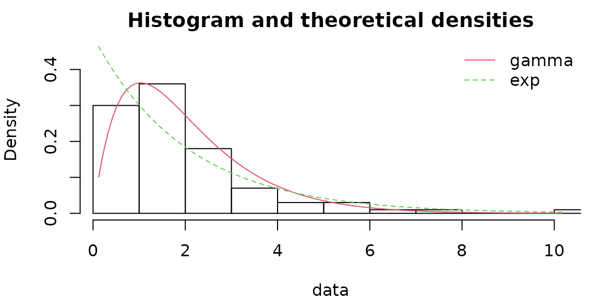

``` r
# results of the tests
## chi square test (with corresponding table with theoretical and observed counts)
g$chisqpvalue
```

    ##    gamma      exp 
    ## 5.77e-01 1.07e-05

``` r
g$chisqtable
```

    ##           obscounts theo gamma theo exp
    ## <= 0.7241         9      10.38    31.43
    ## <= 0.8515         9       4.38     4.41
    ## <= 1.077          9       8.81     7.10
    ## <= 1.348          9      11.44     7.52
    ## <= 1.548          9       8.35     4.89
    ## <= 1.794          9       9.69     5.38
    ## <= 2.05           9       9.03     4.91
    ## <= 2.465          9      11.95     6.68
    ## <= 2.862          9       8.42     5.17
    ## <= 3.423          9       7.87     5.71
    ## > 3.423          10       9.68    16.80

``` r
## Anderson-Darling test
g$adtest
```

    ##          gamma            exp 
    ## "not rejected"     "rejected"

``` r
## Cramer von  Mises test
g$cvmtest
```

    ##          gamma            exp 
    ## "not rejected"     "rejected"

``` r
## Kolmogorov-Smirnov test
g$kstest
```

    ##          gamma            exp 
    ## "not rejected"     "rejected"

### 2.2. Is it reasonable to use goodness-of-fit tests to validate the fit of a distribution ?

In the first versions of fitdistrplus, when they were available, the
results of the GOF tests (AD, KS, CvM) were automatically printed. We
decided to suppress this automatic printing when we realized that some
users had some difficulties to interpret the results of those tests and
sometimes misused them.

Goodness-of-fit tests often appear as objective tools to decide wether a
fitted distribution well describes a data set. **But they are not !** It
would not be reasonable at all to reject a distribution just because a
goodness-of-fit test rejects it (see FAQ 2.2.1). And it would not be
reasonable at all any more to validate a distribution because
goodness-of-fit tests do not reject it (see FAQ 2.2.2).

A fitted distribution should be evaluated using graphical methods
(goodness-of-fit graphs automatically provided in our package by
plotting the result of the fit (output of
[`fitdist()`](https://lbbe-software.github.io/fitdistrplus/reference/fitdist.md)
or
[`fitdistcens()`](https://lbbe-software.github.io/fitdistrplus/reference/fitdistcens.md)
and the complementary graphs that help to compare different fits - see
[`?graphcomp`](https://lbbe-software.github.io/fitdistrplus/reference/graphcomp.md)).
We really think it is the most appropriate way to evaluate the adequacy
of a fit and we are not the only ones to recommend it. You can find the
same type of recommendations in reference books :

- **Probabilistic techniques in exposure assessment - a handbook dealing
  with variability and uncertainty in models and inputs** by A.C. Cullen
  and H.C. Frey.  
- **Application of uncertainty analysis to ecological risks of
  pesticides** by W.J. Warren-Hicks and A. Hart.  
- **Statistical inference** by G. Casella and R.L. Berger
- **Loss models: from data to decision** by S.A. Klugman and H.H. Panjer
  and G.E. Willmot

Moreover, the selection of a distribution should also be driven by
knowledge of underlying processes when available. For example when a
variable cannot be negative, one would be very cautious while fitting a
normal distribution, that potentially gives negative values, even if the
observed data of this variable seem well fitted by a normal
distribution.

#### 2.2.1. Should I reject a distribution because a goodness-of-fit test rejects it ?

No it would not be reasonable at all to reject a distribution just
because a goodness-of-fit test rejects it, especially in the case of big
samples. In the real life, as soon as you have a sufficient amount of
data, you will reject the fitted distribution. We know that a model
cannot perfectly describe real data, and generally the true question is
to find the better distribution among a pool of simple parametric
distributions to describe the data, so to compare different models (see
FAQ 2.4 and 2.5 for corresponding questions).

To illustre this point let us comment the example presented below. We
drew two samples from the same Poisson distribution with a mean
parameter equal to 100. In many applications, for this value of its
parameter, the Poisson distribution would be considered to be well
approximated by a normal distribution. Testing the fit (here using a
Kolmogorov-Smirnov test ) of the normal distribution on a sample of 100
observations would not reject the normal fit, while testing it on a
sample of 10000 observations would reject it, while both samples come
from the same distribution.

``` r
x1 <- rpois(n = 100, lambda = 100)
f1 <- fitdist(x1, "norm")
g1 <- gofstat(f1)
g1$kstest
```

    ##     1-mle-norm 
    ## "not rejected"

``` r
x2 <- rpois(n = 10000, lambda = 100)
f2 <- fitdist(x2, "norm")
g2 <- gofstat(f2)
g2$kstest
```

    ## 1-mle-norm 
    ## "rejected"

``` r
par(mfrow=c(1,2), mar=c(4,4,2,1))
denscomp(f1, demp = TRUE, addlegend = FALSE, main = "small sample")
denscomp(f2, demp = TRUE, addlegend = FALSE, main = "big sample")
```

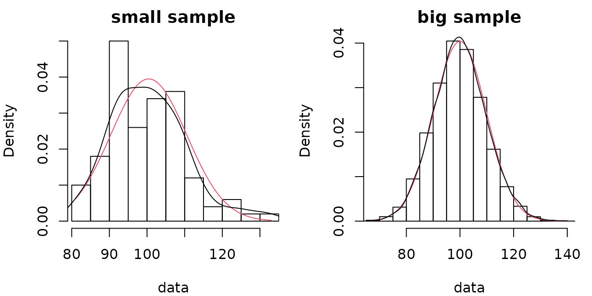

#### 2.2.2. Should I accept a distribution because goodness-of-fit tests do not reject it ?

No, it would not be reasonable at all to validate a distribution because
goodness-of-fit tests do not reject it. Like all the other hypothesis
tests, goodness-of-fit tests lack of statistical power when the sample
size is not so high. And the different goodness-of-fit tests are not
equally sensitive to different types of deviation between empirical and
fitted distributions. For example the Kolmogorov-Smirnov test is
sensitive when distributions differ in a global fashion near the centre
of the distribution. The Anderson-Darling test will be more sensitive
when distributions differ in their tails, and the Cramer von Mises will
be more sensitive when there are small but repetitive differences
between empirical and theoretical distribution functions.

The sensitivity of a chi square test will depend on the definition of
classes, and even if we propose a default definition of classes when the
user does not provide classes, this choice is not obvious and could
impact the results of the test. This test is more appropriate when data
are discrete, even if they are modelled by a continuous distribution, as
in the following example. Two samples of respective sizes 500 and 50 are
drawn from a Poisson distribution of mean parameter equal to 1 (not a
sufficiently high value to consider that the Poisson distribution could
be approximated by a normal one). Using a Kolmogorov-Smirnov test, for
the small sample the normal fit is rejected only for the bigger sample.
It is not rejected with the smaller sample even if the fit could be
rejected after a simple visual confrontation of the distributions. In
that particular case, the chi square test with classes defined by
default would have rejected te normal fit for both samples.

``` r
x3 <- rpois(n = 500, lambda = 1)
f3 <- fitdist(x3, "norm")
g3 <- gofstat(f3)
g3$kstest
```

    ## 1-mle-norm 
    ## "rejected"

``` r
x4 <- rpois(n = 50, lambda = 1)
f4 <- fitdist(x4, "norm")
g4 <- gofstat(f4)
g4$kstest
```

    ## 1-mle-norm 
    ## "rejected"

``` r
par(mfrow=c(1,2), mar=c(4,4,2,1))
denscomp(f3, addlegend = FALSE, main = "big sample") 
denscomp(f4, addlegend = FALSE, main = "small sample")
```


``` r
g3$chisqtable
```

    ##      obscounts theocounts
    ## <= 0     200.0       89.9
    ## <= 1     181.0      167.0
    ## <= 2      76.0      162.0
    ## <= 3      26.0       67.9
    ## > 3       17.0       13.2

``` r
g3$chisqpvalue
```

    ## [1] 4.68e-46

``` r
g4$chisqtable
```

    ##      obscounts theocounts
    ## <= 0     18.00       7.57
    ## <= 1     18.00      17.03
    ## <= 2     10.00      17.35
    ## > 2       4.00       8.05

``` r
g4$chisqpvalue
```

    ## [1] 9.62e-06

### 2.3. Why all goodness-of-fit tests are not available for every distribution ?

The Chi-squared test is available for any distribution but one must be
conscious that its result depends on the definition of cells in which
observed data are grouped, and a correct definition is not possible with
a too small sample.

Concerning the Kolmogorov-Smirnov test, it is proposed for any
continuous distribution, but with a critical value corresponding to the
comparison of the empirical distribution to a fully specified
distribution. As the distribution is not fully known for a fitted
distribution, the result of this test is subject to caution, but there
is no general asymptotic theory for the Kolmogorov-Smirnov statistics in
case of a fitted distribution. Nevertheless, one can use Monte Carlo
methods to conduct Kolmgorov-Smirnov goodness-of-fit tests in cases when
the sample is used to estimate model parameters. Such a method is
implemented in the R package `KScorrect` for a variety of continuous
distributions.

Such an asymptotic theory was proposed for quadratic statistics for some
distributions (Anderson-Darling, Cramer von Mises). The reference book
we used on this subject (**Tests based on edf statistics** by Stephens
MA in **Goodness-of-fit techniques** by D’Agostino RB and Stephens MA)
proposes critical values of those statistics for a some classical
distributions (exponential, gamma, Weibull, logistic, Cauchy, normal and
lognormal). But the asymptotic theory about these statistics also
depends on the way the parameters are estimated. And as they were not
estimated by maximum likelihood for Cauchy, normal and lognormal
distributions in the results reported by Stephens, we only propose the
results of the Anderson-Darling and Cramer von Mises using those results
for exponential, gamma, Weibull, logistic distributions.

The user can refer to the cited books and use the proposed formula to
estimate the parameters of Cauchy, normal and lognormal distributions
and apply the tests using critical values given in the book. R packages
`goftest` and `ADGofTest` could also be explored by users who would like
to apply Anderson-Darling and Cramer von Mises tests on other
distributions. But at this time we are not sure that the case where
parameters are unknown (estimated by maximum likelihood) is tackled in
those two packages.

Concerning the development of our package, rather than develoing further
more goodness-of-fit tests we made the choice to develop graphical tools
to help to appreciate the quality of a fit and to compare the fits of
different distributions on a same data set (see FAQ 2.2 for
argumentation).

### 2.4. How can we use goodness-of-fit statistics to compare the fit of different distributions on a same data set ?

Goodness-of-fit statistics based on the empirical distribution function
(Kolmogorov-Smirnov, Anderson-Darling and Cramer von Mises) may be used
to measure a distance between the fitted distribution and the empirical
distribution. So if one wants to compare the fit of various
distributions on the same data set, the smaller are those statistics the
better. The Kolmogorov-Smirnov statistics will be sensitive when
distributions differ in a global fashion near the centre of the
distribution while the Anderson-Darling statistics will be more
sensitive when distributions differ in their tails, and the Cramer von
Mises statistics will be more sensitive when there are small but
repetitive differences between empirical and theoretical distribution
functions.

But as mentioned in the main vignette of our package, the use of the
Anderson-Darling to compare the fit of different distributions is
subject to caution due to the the weighting of the quadratic distance
between fitted and empirical distribution functions that depends on the
parametric distribution. Moreover, statistics based on the empirical
distribution function do not penalize distributions with a greater
number of parameters and as those are generally more flexible, this
could induce over-fitting.

Goodness-fo-fit statistics based on information criteria (AIC, BIC)
correspond to deviance penalized by the complexity of the model (the
number of parameters of the distribution), and so the smaller the
better. As more generic statistics, they are not adapted to focus on a
part of the fitted distribution, but they take into account the
complexity of the distribution and thus could help to prevent
overfitting.

### 2.5. Can we use a test to compare the fit of two distributions on a same data set ?

In our package we did not implement such a test but for **two nested
distributions** (when one is a special case of the other one, e.g.
exponential and gamma distributions) a likelihood ratio test can be
easily implemented using the loglikelihood provided by `fitdist` or
`fitdistcens`. Denoting $L$ the maximum likelihood obtained with the
complete distribution and $L_{0}$ the one obtained with the simplified
distribution, when the sample size increases,
$- 2ln\left( \frac{L_{0}}{L} \right) = 2ln(L) - 2ln\left( L_{0} \right)$
tends to a Chi squared distribution degrees of freedom equal to the
difference on the numbers of parameters characterizing the **two nested
distributions**. You will find below an example of such a test.

``` r
g <- rgamma(100, shape = 2, rate = 1)
(f <- fitdist(g, "gamma"))
```

    ## Fitting of the distribution ' gamma ' by maximum likelihood 
    ## Parameters:
    ##       estimate Std. Error
    ## shape     2.13      0.281
    ## rate      1.15      0.171

``` r
(f0 <- fitdist(g, "exp"))
```

    ## Fitting of the distribution ' exp ' by maximum likelihood 
    ## Parameters:
    ##      estimate Std. Error
    ## rate    0.542     0.0542

``` r
L <- logLik(f)
k <- length(f$estimate) # number of parameters of the complete distribution
L0 <- logLik(f0)
k0 <- length(f0$estimate) # number of parameters of the simplified distribution
(stat <- 2*L - 2*L0)
```

    ## [1] 26.9

``` r
(critical_value <- qchisq(0.95, df = k - k0))
```

    ## [1] 3.84

``` r
(rejected <- stat > critical_value)
```

    ## [1] TRUE

Such a test can also be used for fits on censored data.

### 2.6. Can we get goodness-of-fit statistics for a fit on censored data ?

Function `gofstat` is not yet proposed in our package for fits on
censored data but to develop one is among one of our objectives in the
future. Published works on goodness-of-fit statistics based on the
empirical distribution function for censored data generally focused on
data containing only one type of censoring (e.g. right censored data in
survival data). Build such statistics in the general case, with data
containing in the same time (right, left and interval censoring),
remains tricky.

Nevertheless, it is possible for any type of censored data, to use
information criteria (AIC and BIC given in the summary of an object of
class `fitdistcens`) to compare the fits of various distributions to a
same data set.

### 2.7. Why Cullen-Frey graph may be misleading?

When considering distribution with large theoretical moments or infinite
moments, using the Cullen-Frey may not be appropriate. A typical is the
log-normal distribution
$\mathcal{L}\mathcal{N}\left( \mu,\sigma^{2} \right)$.

``` r
n <- 1e3
x <- rlnorm(n)
descdist(x)
```

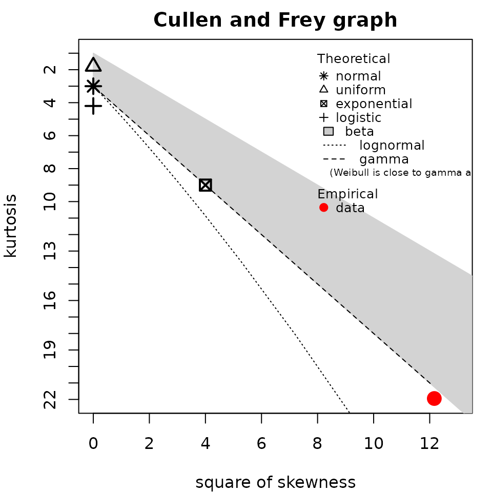

    ## summary statistics
    ## ------
    ## min:  0.0328   max:  19.7 
    ## median:  0.993 
    ## mean:  1.6 
    ## estimated sd:  2.01 
    ## estimated skewness:  3.7 
    ## estimated kurtosis:  21.6

Indeed for that distribution, the skewness and the kurtosis are
functions of the exponential of $\sigma^{2}$. With large values, even
for small $\sigma$.
$$sk(X) = \left( e^{\sigma^{2}} + 2 \right)\sqrt{e^{\sigma^{2}} - 1},kr(X) = e^{4\sigma^{2}} + 2e^{3\sigma^{2}} + 3e^{2\sigma^{2}} - 3.$$

The convergence to theoretical standardized moments (skewness and
kurtosis) is slow 

In the future, we plan to use trimmed linear moments to deal with this
issue. Those moments always exist even for distribution with infinite
mean, e.g. the Cauchy distribution.

## 3. Questions regarding optimization procedures

### 3.1. How to choose optimization method?

If you want to perform optimization without bounds,
[`optim()`](https://rdrr.io/r/stats/optim.html) is used. You can try the
derivative-free method Nelder-Mead and the Hessian-free method BFGS. If
you want to perform optimization with bounds, only two methods are
available without providing the gradient of the objective function:
Nelder-Mead via
[`constrOptim()`](https://rdrr.io/r/stats/constrOptim.html) and bounded
BFGS via [`optim()`](https://rdrr.io/r/stats/optim.html). In both cases,
see the help of
[`mledist()`](https://lbbe-software.github.io/fitdistrplus/reference/mledist.md)
and the vignette on optimization algorithms.

### 3.2. The optimization algorithm stops with error code, e.g., 100. What shall I do?

First, add traces by adding `control=list(trace=1, REPORT=1)`. Second,
try to set bounds for parameters, typically shape and rate parameters
are generally positive. Third, try better starting values (see FAQ 1.3)
or change the optimization method.

A short example is given below of a fit of a Burr distribution. By
default, the Nelder-Mead algorithm is used which reaches the iteration
limit and raises error code 1.

``` r
data("danishuni")
try(fitdist(danishuni$Loss, "burr"))
```

    ## Error in fitdist(danishuni$Loss, "burr") : 
    ##   the function mle failed to estimate the parameters, 
    ##                 with the error code 1

If we increase the maximum number of iteration, it does not help and we
get a non-finite finite-difference value, yet Nelder-Mead may handle
infinite values.

``` r
try(fitdist(danishuni$Loss, "burr", control=list(maxit=1000)))
```

    ## <simpleError in optim(par = vstart, fn = fnobj, fix.arg = fix.arg, obs = data,     gr = gradient, ddistnam = ddistname, hessian = TRUE, method = meth,     lower = lower, upper = upper, ...): non-finite finite-difference value [1]>
    ## Error in fitdist(danishuni$Loss, "burr", control = list(maxit = 1000)) : 
    ##   the function mle failed to estimate the parameters, 
    ##                 with the error code 100

If we set bounds, it only helps with an upper bound on parameters
values. But the upper bound should be relatively small.

``` r
try(fitdist(danishuni$Loss, "burr", lower=0))
```

    ## Error in fitdist(danishuni$Loss, "burr", lower = 0) : 
    ##   the function mle failed to estimate the parameters, 
    ##                 with the error code 7

``` r
try(fitBurr_cvg1 <- fitdist(danishuni$Loss, "burr", upper=100))
try(fitdist(danishuni$Loss, "burr", upper=1000))
```

    ## Error in fitdist(danishuni$Loss, "burr", upper = 1000) : 
    ##   the function mle failed to estimate the parameters, 
    ##                 with the error code 7

Using another algorithm, such as the BFGS algorithm, helps the
convergence as long as we set a lower bound.

``` r
try(fitBurr_cvg2 <- fitdist(danishuni$Loss, "burr", lower=.Machine$double.eps,
                            optim.method="L-BFGS-B"))
```

The fitted values have the same magnitude and the fits are appropriate.

``` r
cdfcomp(list(fitBurr_cvg1, fitBurr_cvg2), xlogscale = TRUE, fitlwd = 2)
```

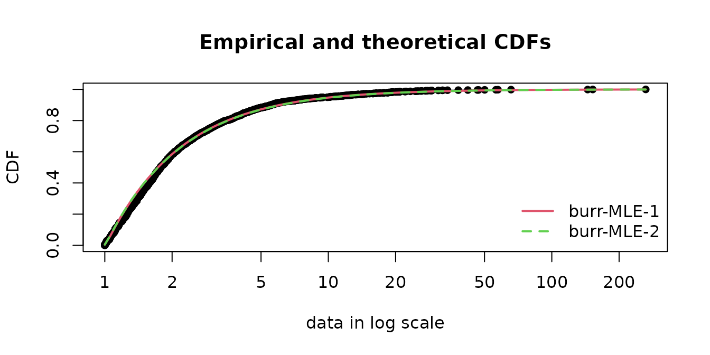

``` r
sapply(list(fitBurr_cvg1, fitBurr_cvg2), coef)
```

    ##          [,1]     [,2]
    ## shape1  0.014 9.86e-03
    ## shape2 91.561 1.29e+02
    ## scale   1.008 1.00e+00

The
[`llplot()`](https://lbbe-software.github.io/fitdistrplus/reference/logLik-plot.md)
function helps in understanding how good is the fit.
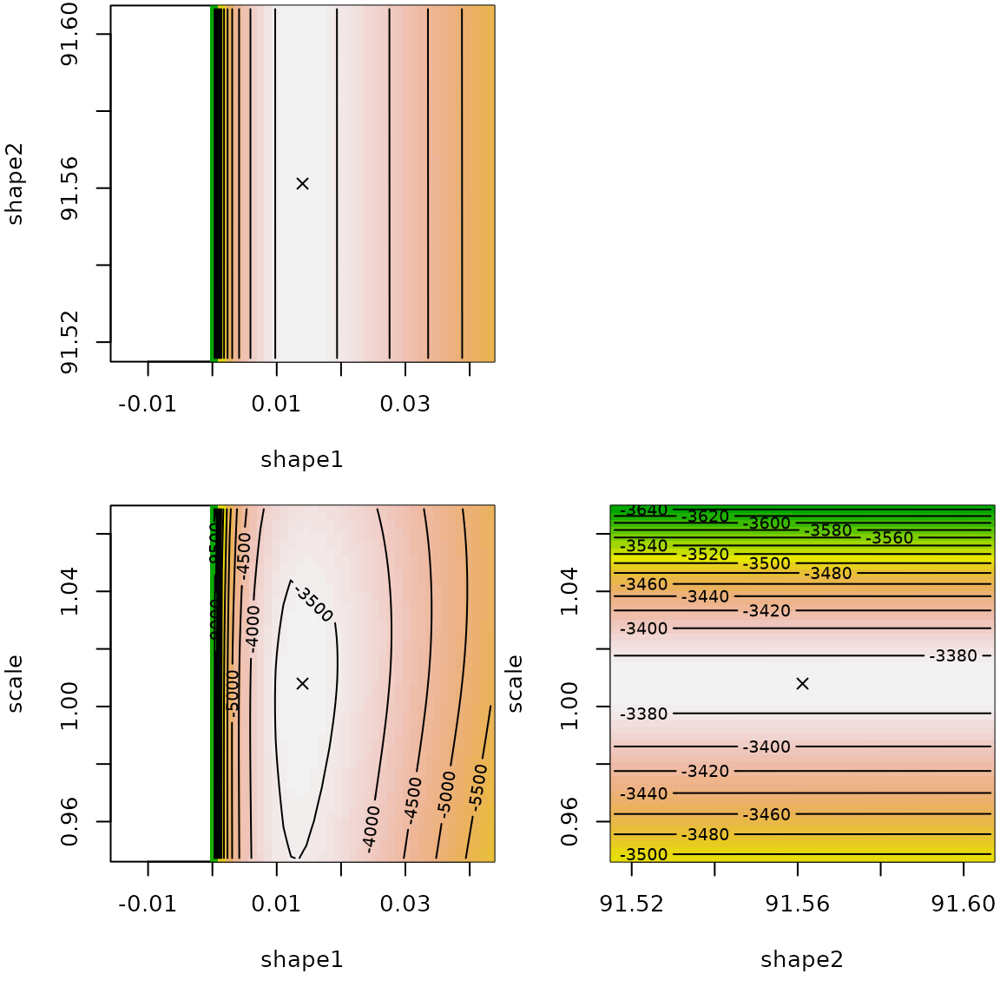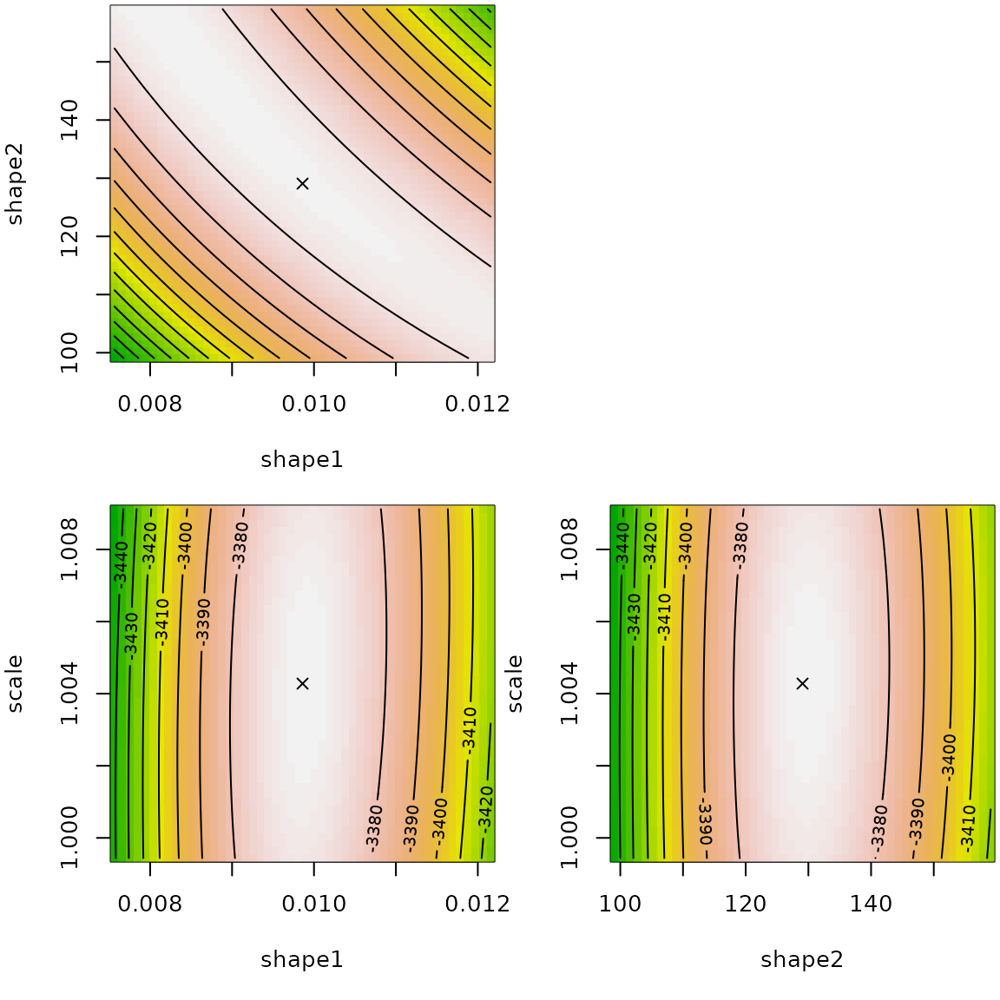

The log-likelihood surface is rather flat around the fitted values in
shape1/shape2 spaces. We observe a certain dependency so that the
product of shape parameters is almost constant.

``` r
print(prod(coef(fitBurr_cvg1)[1:2]), digits=5)
```

    ## [1] 1.2834

``` r
print(prod(coef(fitBurr_cvg2)[1:2]), digits=5)
```

    ## [1] 1.2727

In terms of computation time, we retrieve that the Nelder-Mead algorithm
is slower.

``` r
system.time(fitdist(danishuni$Loss, "burr", upper=100))
```

    ##    user  system elapsed 
    ##   0.252   0.000   0.252

``` r
system.time(fitdist(danishuni$Loss, "burr", lower=.Machine$double.eps, optim.method="L-BFGS-B"))
```

    ##    user  system elapsed 
    ##   0.118   0.000   0.117

### 3.3 Why distribution with a `log` argument may converge better?

Say, we study the shifted lognormal distribution defined by the
following density
$$f(x) = \frac{1}{x\sigma\sqrt{2\pi}}\exp\left( - \frac{\left( \ln(x + \delta) - \mu \right)^{2}}{2\sigma^{2}} \right)$$
for $x > - \delta$ where $\mu$ is a location parameter, $\sigma$ a scale
parameter and $\delta$ a boundary parameter. Let us fit this
distribution on the dataset `y` by MLE. We define two functions for the
densities with and without a `log` argument.

``` r
dshiftlnorm <- function(x, mean, sigma, shift, log = FALSE) 
  dlnorm(x+shift, mean, sigma, log=log)
pshiftlnorm <- function(q, mean, sigma, shift, log.p = FALSE) 
  plnorm(q+shift, mean, sigma, log.p=log.p)
qshiftlnorm <- function(p, mean, sigma, shift, log.p = FALSE) 
  qlnorm(p, mean, sigma, log.p=log.p)-shift
dshiftlnorm_no <- function(x, mean, sigma, shift) 
  dshiftlnorm(x, mean, sigma, shift)
pshiftlnorm_no <- function(q, mean, sigma, shift) 
  pshiftlnorm(q, mean, sigma, shift)
```

We now optimize the minus log-likelihood.

``` r
data(dataFAQlog1)
y <- dataFAQlog1
D <- 1-min(y)
f0 <- fitdist(y+D, "lnorm")
start <- list(mean=as.numeric(f0$estimate["meanlog"]),  
              sigma=as.numeric(f0$estimate["sdlog"]), shift=D)
# works with BFGS, but not Nelder-Mead
f <- fitdist(y, "shiftlnorm", start=start, optim.method="BFGS")
summary(f)
```

    ## Fitting of the distribution ' shiftlnorm ' by maximum likelihood 
    ## Parameters : 
    ##       estimate Std. Error
    ## mean   -1.3848    0.02409
    ## sigma   0.0709    0.00192
    ## shift   0.2487    0.00601
    ## Loglikelihood:  8299   AIC:  -16591   BIC:  -16573 
    ## Correlation matrix:
    ##         mean  sigma  shift
    ## mean   1.000 -0.885  0.999
    ## sigma -0.885  1.000 -0.887
    ## shift  0.999 -0.887  1.000

If we don’t use the `log` argument, the algorithms stalls.

``` r
f2 <- try(fitdist(y, "shiftlnorm_no", start=start, optim.method="BFGS"))
print(attr(f2, "condition"))
```

    ## NULL

Indeed the algorithm stops because at the following value, the
log-likelihood is infinite.

``` r
sum(log(dshiftlnorm_no(y, 0.16383978, 0.01679231, 1.17586600 )))
```

    ## [1] -Inf

``` r
log(prod(dshiftlnorm_no(y, 0.16383978, 0.01679231, 1.17586600 )))
```

    ## [1] -Inf

``` r
sum(dshiftlnorm(y, 0.16383978, 0.01679231, 1.17586600, TRUE ))
```

    ## [1] 7761

There is something wrong in the computation.

Only the R-base implementation using `log` argument seems reliable. This
happens the C-base implementation of `dlnorm` takes care of the log
value. In the file `../src/nmath/dlnorm.c` in the R sources, we find the
C code for `dlnorm`

``` r
double dlnorm(double x, double meanlog, double sdlog, int give_log)
{
    double y;

#ifdef IEEE_754
    if (ISNAN(x) || ISNAN(meanlog) || ISNAN(sdlog))
    return x + meanlog + sdlog;
#endif
    if(sdlog <= 0) {
    if(sdlog < 0) ML_ERR_return_NAN;
    // sdlog == 0 :
    return (log(x) == meanlog) ? ML_POSINF : R_D__0;
    }
    if(x <= 0) return R_D__0;

    y = (log(x) - meanlog) / sdlog;
    return (give_log ?
        -(M_LN_SQRT_2PI   + 0.5 * y * y + log(x * sdlog)) :
        M_1_SQRT_2PI * exp(-0.5 * y * y)  /  (x * sdlog));
    /* M_1_SQRT_2PI = 1 / sqrt(2 * pi) */

}
```

In the last four lines with the logical condtion `give_log?`, we see how
the `log` argument is handled:

- when log=TRUE, we use
  $- \left( \log\left( \sqrt{2\pi} \right) + y^{2}/2 + \log(x\sigma) \right)$

``` r
-(M_LN_SQRT_2PI   + 0.5 * y * y + log(x * sdlog))
```

- when log=FALSE, we use
  $\sqrt{2\pi}*\exp\left( y^{2}/2 \right)/(x\sigma))$ (and then the
  logarithm outside `dlnorm`)

``` r
M_1_SQRT_2PI * exp(-0.5 * y * y)  /  (x * sdlog))
```

Note that the constant $\log\left( \sqrt{2\pi} \right)$ is pre-computed
in the C macro `M_LN_SQRT_2PI`.

In order to sort out this problem, we use the `constrOptim` wrapping
`optim` to take into account linear constraints. This allows also to use
other optimization methods than L-BFGS-B (low-memory BFGS bounded) used
in optim.

``` r
f2 <- fitdist(y, "shiftlnorm", start=start, lower=c(-Inf, 0, -min(y)), 
              optim.method="Nelder-Mead")
```

    ## Warning in cov2cor(varcovar): diag(V) had non-positive or NA entries; the
    ## non-finite result may be dubious

    ## Warning in sqrt(diag(varcovar)): NaNs produced

``` r
summary(f2)
```

    ## Fitting of the distribution ' shiftlnorm ' by maximum likelihood 
    ## Parameters : 
    ##       estimate Std. Error
    ## mean   -1.3872        NaN
    ## sigma   0.0711        NaN
    ## shift   0.2481        NaN
    ## Loglikelihood:  8299   AIC:  -16591   BIC:  -16573 
    ## Correlation matrix:
    ##       mean sigma shift
    ## mean     1   NaN   NaN
    ## sigma  NaN     1   NaN
    ## shift  NaN   NaN     1

``` r
print(cbind(BFGS=f$estimate, NelderMead=f2$estimate))
```

    ##          BFGS NelderMead
    ## mean  -1.3848    -1.3872
    ## sigma  0.0709     0.0711
    ## shift  0.2487     0.2481

Another possible would be to perform all computations with higher
precision arithmetics as implemented in the package `Rmpfr` using the
MPFR library.

### 3.4. What to do when there is a scaling issue?

Let us consider a dataset which has particular small values.

``` r
data(dataFAQscale1)
head(dataFAQscale1)
```

    ## [1] -0.007077 -0.000947 -0.001898 -0.000475 -0.001902 -0.000476

``` r
summary(dataFAQscale1)
```

    ##      Min.   1st Qu.    Median      Mean   3rd Qu.      Max. 
    ## -0.007077 -0.001435 -0.000473 -0.000309  0.000959  0.004285

The only way to sort out is to multiply the dataset by a large value.

``` r
for(i in 6:0)
cat(10^i, try(mledist(dataFAQscale1*10^i, "cauchy")$estimate), "\n")
```

    ## 1e+06 -290 1194 
    ## 1e+05 -29 119 
    ## 10000 -2.9 11.9 
    ## 1000 -0.29 1.19 
    ## 100 -0.029 0.119 
    ## 10 -0.0029 0.0119 
    ## <simpleError in optim(par = vstart, fn = fnobj, fix.arg = fix.arg, obs = data,     gr = gradient, ddistnam = ddistname, hessian = TRUE, method = meth,     lower = lower, upper = upper, ...): non-finite finite-difference value [2]>
    ## 1 NA NA

Let us consider a dataset which has particular large values.

``` r
data(dataFAQscale2)
head(dataFAQscale2)
```

    ## [1] 1.40e+09 1.41e+09 1.43e+09 1.44e+09 1.49e+09 1.57e+09

``` r
summary(dataFAQscale2)
```

    ##     Min.  1st Qu.   Median     Mean  3rd Qu.     Max. 
    ## 1.40e+09 1.58e+09 2.24e+09 2.55e+09 3.39e+09 4.49e+09

The only way to sort out is to multiply the dataset by a small value.

``` r
for(i in 0:5)
cat(10^(-2*i), try(mledist(dataFAQscale2*10^(-2*i), "cauchy")$estimate), "\n")
```

    ## 1 2.03e+09 6.59e+08 
    ## 0.01 20283641 6594932 
    ## 1e-04 202836 65949 
    ## 1e-06 2028 659 
    ## 1e-08 20.3 6.59 
    ## 1e-10 0.203 0.0659

### 3.5. How do I set bounds on parameters when optimizing?

#### 3.5.1. Setting bounds for scale parameters

Consider the normal distribution
$\mathcal{N}\left( \mu,\sigma^{2} \right)$ defined by the density
$$f(x) = \frac{1}{\sqrt{2\pi\sigma^{2}}}\exp\left( - \frac{(x - \mu)^{2}}{2\sigma^{2}} \right),x \in {\mathbb{R}},$$
where $\mu$ is a location parameter such that $\mu \in {\mathbb{R}}$,
$\sigma^{2}$ is a scale parameter such that $\sigma^{2} > 0$. Therefore
when optimizing the log-likelihood or the squared differences or the GoF
statistics. Setting a lower bound for the scale parameter is easy with
`fitdist`: just use the `lower` argument.

``` r
x <- rnorm(1000, 1, 2)
fitdist(x, "norm", lower=c(-Inf, 0))
```

    ## Fitting of the distribution ' norm ' by maximum likelihood 
    ## Parameters:
    ##      estimate Std. Error
    ## mean     1.07     0.0621
    ## sd       1.96     0.0439

#### 3.5.2. Setting bounds for shape parameters

Consider the Burr distribution
$\mathcal{B}\left( \mu,\sigma^{2} \right)$ defined by the density
$$f(x) = \frac{ab(x/s)^{b}}{x\left\lbrack 1 + (x/s)^{b} \right\rbrack^{a + 1}},x \in {\mathbb{R}},$$
where $a,b$ are shape parameters such that $a,b > 0$, $s$ is a scale
parameter such that $s > 0$.

``` r
x <- rburr(1000, 1, 2, 3)
fitdist(x, "burr", lower=c(0, 0, 0), start=list(shape1 = 1, shape2 = 1, 
  rate = 1))
```

    ## Fitting of the distribution ' burr ' by maximum likelihood 
    ## Parameters:
    ##        estimate Std. Error
    ## shape1     1.02     0.0335
    ## shape2     2.00     0.0363
    ## rate       2.93     0.0512

#### 3.5.3. Setting bounds for probability parameters

Consider the geometric distribution $\mathcal{G}(p)$ defined by the mass
probability function $$f(x) = p(1 - p)^{x},x \in {\mathbb{N}},$$ where
$p$ is a probability parameter such that $p \in \lbrack 0,1\rbrack$.

``` r
x <- rgeom(1000, 1/4)
fitdist(x, "geom", lower=0, upper=1)
```

    ## Fitting of the distribution ' geom ' by maximum likelihood 
    ## Parameters:
    ##      estimate Std. Error
    ## prob    0.247    0.00677

#### 3.5.4. Setting bounds for boundary parameters

Consider the shifted exponential distribution $\mathcal{E}(\mu,\lambda)$
defined by the mass probability function
$$f(x) = \lambda\exp\left( - \lambda(x - \mu) \right),x > \mu,$$ where
$\lambda$ is a scale parameter such that $\lambda > 0$, $\mu$ is a
boundary (or shift) parameter such that $\mu \in {\mathbb{R}}$. When
optimizing the log-likelihood, the boundary constraint is
$$\left. \forall i = 1,\ldots,n,x_{i} > \mu\Rightarrow\min\limits_{i = 1,\ldots,n}x_{i} > \mu\Leftrightarrow\mu > - \min\limits_{i = 1,\ldots,n}x_{i}. \right.$$
Note that when optimizing the squared differences or the GoF statistics,
this constraint may not be necessary. Let us do it in R.

``` r
dsexp <- function(x, rate, shift)
  dexp(x-shift, rate=rate)
psexp <- function(x, rate, shift)
  pexp(x-shift, rate=rate)
rsexp <- function(n, rate, shift)
  rexp(n, rate=rate)+shift
x <- rsexp(1000, 1/4, 1)
fitdist(x, "sexp", start=list(rate=1, shift=0), upper= c(Inf, min(x)))
```

    ## Fitting of the distribution ' sexp ' by maximum likelihood 
    ## Parameters:
    ##       estimate Std. Error
    ## rate     0.243        NaN
    ## shift    1.004        NaN

#### 3.5.5. Setting linear inequality bounds

For some distributions, bounds between parameters are not independent.
For instance, the normal inverse Gaussian distribution
($\mu,\delta,\alpha,\beta$ parametrization) has the following parameter
constraints, which can be reformulated as a linear inequality:
$$\left. \left\{ \begin{array}{l}
{\alpha > 0} \\
{\delta > 0} \\
{\alpha > |\beta|}
\end{array} \right.\Leftrightarrow\underset{ui}{\underbrace{\begin{pmatrix}
0 & 1 & 0 & 0 \\
0 & 0 & 1 & 0 \\
0 & 0 & 1 & {- 1} \\
0 & 0 & 1 & 1 \\
 & & & 
\end{pmatrix}}}\begin{pmatrix}
\mu \\
\delta \\
\alpha \\
\beta \\

\end{pmatrix} \geq \underset{ci}{\underbrace{\begin{pmatrix}
0 \\
0 \\
0 \\
0 \\

\end{pmatrix}}}. \right.$$ These constraints can be carried out via
[`constrOptim()`](https://rdrr.io/r/stats/constrOptim.html) and the
arguments `ci` and `ui`. Here is an example

``` r
require("GeneralizedHyperbolic")
myoptim <- function(fn, par, ui, ci, ...)
{
  res <- constrOptim(f=fn, theta=par, method="Nelder-Mead", ui=ui, ci=ci, ...)
  c(res, convergence=res$convergence, value=res$objective, 
    par=res$minimum, hessian=res$hessian)
}
x <- rnig(1000, 3, 1/2, 1/2, 1/4)
ui <- rbind(c(0,1,0,0), c(0,0,1,0), c(0,0,1,-1), c(0,0,1,1))
ci <- c(0,0,0,0)
fitdist(x, "nig", custom.optim=myoptim, ui=ui, ci=ci, start=list(mu = 0, delta = 1, alpha = 1, beta = 0))
```

    ## Warning in fitdist(x, "nig", custom.optim = myoptim, ui = ui, ci = ci, start =
    ## list(mu = 0, : The dnig function should return a vector of with NaN values when
    ## input has inconsistent parameters and not raise an error

    ## Warning in fitdist(x, "nig", custom.optim = myoptim, ui = ui, ci = ci, start =
    ## list(mu = 0, : The pnig function should return a vector of with NaN values when
    ## input has inconsistent values and not raise an error

    ## Fitting of the distribution ' nig ' by maximum likelihood 
    ## Parameters:
    ##       estimate
    ## mu       2.993
    ## delta    0.504
    ## alpha    0.445
    ## beta     0.256

### 3.6. How does quantile matching estimation work for discrete distributions?

Let us consider the geometric distribution with values in
$\{ 0,1,2,3,\ldots\}$. The probability mass function, the cumulative
distribution function and the quantile function are
$$P(X = x) = p(1 - p)^{\lfloor x\rfloor},F_{X}(x) = 1 - (1 - p)^{\lfloor x\rfloor},F_{X}^{- 1}(q) = \left\lfloor \frac{\log(1 - q)}{\log(1 - p)} \right\rfloor.$$
Due to the integer part (floor function), both the distribution function
and the quantile function are step functions.

``` r
pgeom(0:3, prob=1/2)
```

    ## [1] 0.500 0.750 0.875 0.938

``` r
qgeom(c(0.3, 0.6, 0.9), prob=1/2)
```

    ## [1] 0 1 3

``` r
par(mar=c(4,4,2,1), mfrow=1:2)
curve(pgeom(x, prob=1/2), 0, 10, n=301, main="c.d.f.")
curve(qgeom(x, prob=1/2), 0, 1, n=301, main="q.f.")
```


Now we study the QME for the geometric distribution. Since we have only
one parameter, we choose one probabiliy, $p = 1/2$. The theoretical
median is the following integer
$$F_{X}^{- 1}(1/2) = \left\lfloor \frac{\log(1/2)}{\log(1 - p)} \right\rfloor.$$
Note that the theoretical median for a discrete distribution is an
integer. Empirically, the median may not be an integer. Indeed for an
even length dataset, the empirical median is
$$q_{n,1/2} = \frac{x_{n/2}^{\star} + x_{n/2 + 1}^{\star}}{2},$$ where
$x_{1}^{\star} < \ldots < x_{n}^{\star}$ is the sorted sample, which is
not an integer value if $x_{n/2}^{\star} + x_{n/2 + 1}^{\star}$ is not
an even number. However for an odd length dataset, the empirical median
is an integer $q_{n,1/2} = x_{{(n + 1)}/2}^{\star}$.

``` r
x <- c(0, 0, 0, 0, 1, 1, 3, 2, 1, 0, 0)
median(x[-1]) #sample size 10
```

    ## [1] 0.5

``` r
median(x) #sample size 11
```

    ## [1] 0

Therefore, a first issue arises: if the median is not an integer, it is
impossible to match exactly the empirical median with the theoretical
quantile.

Furthermore, the second issue is the non-uniqueness of the solution.
Admitting matching $q_{n,1/2}$ is an integer, QME aims to find some $p$
such that
$$\left. \left\lfloor \frac{\log(1/2)}{\log(1 - p)} \right\rfloor = q_{n,1/2}\Leftrightarrow q_{n,1/2} \leq \frac{\log(1/2)}{\log(1 - p)} < q_{n,1/2} + 1. \right.$$
Let us plot the squared differences
$\left( F_{X}^{- 1}(1/2) - q_{n,1/2} \right)^{2}$.

``` r
x <- rgeom(100, 1/3)
L2 <- function(p)
  (qgeom(1/2, p) - median(x))^2
L2(1/3) #theoretical value
```

    ## [1] 0

``` r
par(mfrow=c(1,1), mar=c(4,4,2,1))
curve(L2(x), 0.10, 0.95, xlab=expression(p), ylab=expression(L2(p)), 
      main="squared differences", type="s")
```


Any value between \[1/3, 5/9\] minimizes the squared differences.
Therefore,
[`fitdist()`](https://lbbe-software.github.io/fitdistrplus/reference/fitdist.md)
may be sensitive to the chosen initial value with deterministic
optimization algorithm.

``` r
fitdist(x, "geom", method="qme", probs=1/2, start=list(prob=1/2), 
        control=list(trace=1, REPORT=1))
```

    ## initial  value 1.000000 
    ## iter   2 value 0.000000
    ## iter   2 value 0.000000
    ## iter   2 value 0.000000
    ## final  value 0.000000 
    ## converged

    ## Fitting of the distribution ' geom ' by matching quantiles 
    ## Parameters:
    ##      estimate
    ## prob     0.34

``` r
fitdist(x, "geom", method="qme", probs=1/2, start=list(prob=1/20), 
        control=list(trace=1, REPORT=1))
```

    ## initial  value 144.000000 
    ## iter   1 value 144.000000
    ## final  value 144.000000 
    ## converged

    ## Fitting of the distribution ' geom ' by matching quantiles 
    ## Parameters:
    ##      estimate
    ## prob     0.05

The solution is to use a stochastic algorithm such as simulated
annealing (SANN).

``` r
fitdist(x, "geom", method="qme", probs=1/2, optim.method="SANN", start=list(prob=1/20))
```

    ## Fitting of the distribution ' geom ' by matching quantiles 
    ## Parameters:
    ##      estimate
    ## prob    0.415

``` r
fitdist(x, "geom", method="qme", probs=1/2, optim.method="SANN", start=list(prob=1/2))
```

    ## Fitting of the distribution ' geom ' by matching quantiles 
    ## Parameters:
    ##      estimate
    ## prob    0.461

Let us consider the Poisson distribution defined by the following mass
probability and the cumulative distribution functions
$$P(X = k) = \frac{\lambda^{k}}{k!}\exp( - \lambda),\ F_{X}(x) = \exp( - \lambda)\sum\limits_{k = 0}^{\lfloor x\rfloor}\frac{\lambda^{k}}{k!},\ x \geq 0.$$
The quantile function
$F_{X}^{- 1}(p) = \inf\left( x,F_{X}(x) \geq p \right)$ simplifies to
$$F_{X}^{- 1}(p) = i{\mspace{6mu}\text{such that}\mspace{6mu}}\sum\limits_{k = 0}^{i - 1}P(X = k) \leq p < \sum\limits_{k = 0}^{i}P(X = k).$$
Again, the quantile function is a step function
$$F_{X}^{- 1}(p) = \begin{cases}
0 & {{\text{if}\mspace{6mu}}p < P(X = 0)} \\
1 & {{\text{if}\mspace{6mu}}P(X = 0) \leq p < P(X = 0) + P(X = 1)} \\
2 & {{\text{if}\mspace{6mu}}P(X = 0) + P(X = 1) \leq p < P(X = 0) + P(X = 1) + P(X = 2)} \\
\ldots & \\
i & {{\text{if}\mspace{6mu}}\sum\limits_{k = 0}^{i - 1}P(X = k) \leq p < \sum\limits_{k = 0}^{i}P(X = k)} \\
\ldots & \\
 & 
\end{cases}$$

Again, the squared differences is a step function
$\left( F_{X}^{- 1}(1/2) - q_{n,1/2} \right)^{2}$.

``` r
x <- rpois(100, lambda=7.5)
L2 <- function(lam)
  (qpois(1/2, lambda = lam) - median(x))^2
par(mfrow=c(1,1), mar=c(4,4,2,1))
curve(L2(x), 6, 9, xlab=expression(lambda), ylab=expression(L2(lambda)), 
      main="squared differences", type="s")
```


Therefore, using
[`fitdist()`](https://lbbe-software.github.io/fitdistrplus/reference/fitdist.md)
may be sensitive to the chosen initial value.

``` r
fitdist(x, "pois", method="qme", probs=1/2, start=list(lambda=2))
```

    ## Fitting of the distribution ' pois ' by matching quantiles 
    ## Parameters:
    ##        estimate
    ## lambda        2

``` r
fitdist(x, "pois", method="qme", probs=1/2, optim.method="SANN", start=list(lambda=2))
```

    ## Fitting of the distribution ' pois ' by matching quantiles 
    ## Parameters:
    ##        estimate
    ## lambda     6.74

### 3.7. Why setting a parameter to the true value does not lead to the expected result for other parameters?

Consider the gamma truncated distribution defined by the following
density and cumulative distribution functions

``` r
#NB: using the logical vector condition is the optimal way to compute pdf and cdf
dtgamma <- function(x, shape, rate, low, upp)
{
  PU <- pgamma(upp, shape = shape, rate = rate)
  PL <- pgamma(low, shape = shape, rate = rate)
  dgamma(x, shape, rate) / (PU - PL) * (x >= low) * (x <= upp) 
}
ptgamma <- function(q, shape, rate, low, upp)
{
  PU <- pgamma(upp, shape = shape, rate = rate)
  PL <- pgamma(low, shape = shape, rate = rate)
  (pgamma(q, shape, rate) - PL) / (PU - PL) * (q >= low) * (q <= upp) + 1 * (q > upp)
}
```

Simulating from a truncated distribution is done by rejection outside
`[low, upp]` interval.

``` r
rtgamma <- function(n, shape, rate, low=0, upp=Inf, maxit=10)
{
  stopifnot(n > 0)
  if(low > upp)
    return(rep(NaN, n))
  PU <- pgamma(upp, shape = shape, rate = rate)
  PL <- pgamma(low, shape = shape, rate = rate)
  #simulate directly expected number of random variate
  n2 <- n/(PU-PL)
  x <- rgamma(n, shape=shape, rate=rate)
  x <- x[x >= low & x <= upp]
  i <- 0 
  while(length(x) < n && i < maxit)
  {
    n2 <- (n-length(x))/(PU-PL)
    y <- rgamma(n2, shape=shape, rate=rate)
    x <- c(x, y[y >= low & y <= upp])
    i <- i+1
  }
  x[1:n]
}
```

Consider a sample of lower-truncated gamma distribution.

``` r
n <- 100 ; shape <- 11 ; rate <- 3 ; x0 <- 5
x <- rtgamma(n, shape = shape, rate = rate, low=x0)
```

Fitting two parameters (and setting `low` parameter) or fitting all
three parameters lead a poorer result both in terms of mean squared
error or relative error. Notably the shape parameter is badly estimated.

``` r
fit.NM.2P <- fitdist(
  data = x,
  distr = "tgamma",
  method = "mle",
  start = list(shape = 10, rate = 10),
  fix.arg = list(upp = Inf, low=x0),
  lower = c(0, 0), upper=c(Inf, Inf))
```

    ## Warning in cov2cor(varcovar): diag(V) had non-positive or NA entries; the
    ## non-finite result may be dubious

    ## Warning in sqrt(diag(varcovar)): NaNs produced

``` r
fit.NM.3P <- fitdist(
  data = x,
  distr = "tgamma",
  method = "mle",
  start = list(shape = 10, rate = 10, low=1),
  fix.arg = list(upp = Inf),
  lower = c(0, 0, -Inf), upper=c(Inf, Inf, min(x)))
```

    ## Warning in cov2cor(varcovar): diag(V) had non-positive or NA entries; the
    ## non-finite result may be dubious
    ## Warning in cov2cor(varcovar): NaNs produced

    ##                  fit3P  fit2P true value
    ## shape          12.4460 13.423         11
    ## rate            3.1266  3.275          3
    ## low             5.0052  5.000          5
    ## mean sq. error  0.7023  1.982          0
    ## rel. error      0.0582  0.104          0

However the fitted cumulative distributions are indistinguable. See
figure below. 

The reason is that the log-likelihood is not the same between the two
cases. Changing the optimization method is useless. The graph below
display the likelihood contours as well as optimization iterates (grey
crosses), the final estimate (black cross) and the true value (red dot).
Iterates get stuck far from the true value.
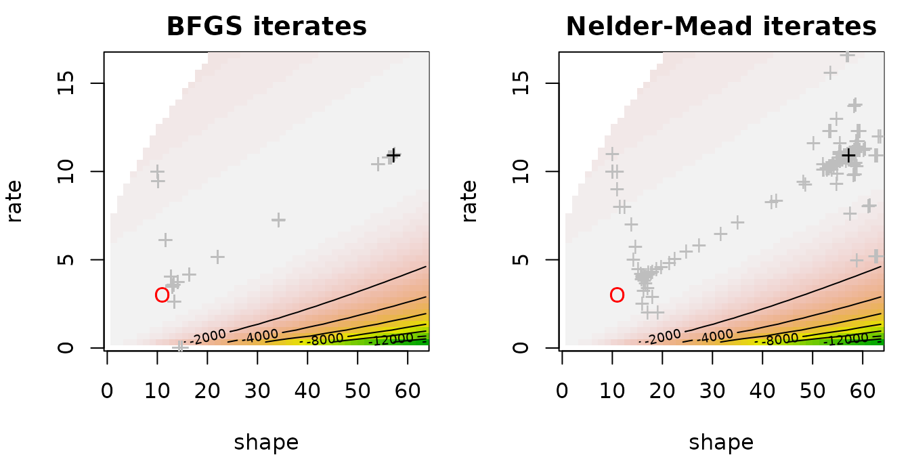

In fact the log-likelihood as a function of the shape parameter may be
monotone. 

Fitting a two-parameter distribution (i.e. gamma) on the shifted dataset
is worse.

``` r
fit.gamma <- fitdist(
  data = x-x0,
  distr = "gamma",
  method = "mle")
```

    ##                  fit3P fit2P orig. data fit2P shift data true value
    ## shape          12.4460           13.423            1.222         11
    ## rate            3.1266            3.275            1.584          3
    ## low             5.0052            5.000            5.000          5
    ## mean sq. error  0.7023            1.982           32.537          0
    ## rel. error      0.0582            0.104            0.454          0

Changing the sample size improves the two-parameter fit very slowly even
as the MLE of the `low` parameter is in fact the minimum of the dataset:
the fitted `low` converges quickly to the true value. Below an example
with 1000 variates.

    ## Warning in cov2cor(varcovar): diag(V) had non-positive or NA entries; the
    ## non-finite result may be dubious

    ## Warning in sqrt(diag(varcovar)): NaNs produced

    ## Warning in cov2cor(varcovar): diag(V) had non-positive or NA entries; the
    ## non-finite result may be dubious

    ## Warning in sqrt(diag(varcovar)): NaNs produced

    ##                  fit3P fit2P orig. data true value
    ## shape          12.0355          10.6653         11
    ## rate            3.1299           2.9059          3
    ## low             5.0008           5.0000          5
    ## mean sq. error  0.3631           0.0403          0
    ## rel. error      0.0459           0.0206          0

## 4. Questions regarding uncertainty

### 4.1. Can we compute marginal confidence intervals on parameter estimates from their reported standard error ?

In statistics, deriving marginal confidence intervals on MLE parameter
estimates using the approximation of their standard errors (calculated
from the hessian) is a quite common procedure. It is based on the wald
approximation which stands that when the sample size $n$ is sufficiently
high, the marginal $95\%$ confidence on the ith component $\theta_{i}$
of a model parameter $\theta$ estimated by maximum likelihood (estimate
denoted $\widehat{\theta}$) can be approximated by :
${\widehat{\theta}}_{i} \pm 1.96 \times SE\left( {\widehat{\theta}}_{i} \right)$
with $SE\left( {\widehat{\theta}}_{i} \right)$ the ith term of the
diagonal of the covariance matrix of the estimates ($V_{ii}$). $V$ is
generally approximated by the inverse of the Fisher information matrix
($I\left( \widehat{\theta} \right)$). The Fisher information matrix
corresponds to the opposite of the hessian matrix evaluated on the MLE
estimate. Let us recall that the hessian matrix is defined by
$H_{ij}(y,\theta) = \frac{\partial^{2}L(y,\theta)}{\partial\theta_{i}\partial\theta_{j}}$
with $L(y,\theta)$ the loglikelihod function for data $y$ and parameter
$\theta$.

Before using this approximation, one must keep in mind that its validity
does not only depend on the sample size. It also strongly depends on the
data, of the distribution, and also on the parameterization of the
distribution. For this reason we recommend potential users of the Wald
approximation to compare the results to the ones obtained using the
bootstrap procedure (see below) before using this approximation. A look
at the loglikelihood contours is also interesting as the Wald
approximation assumes elliptical contours. **In a more general context,
we recommend the use of bootstrap to compute confidence intervals on
parameters or on any function of those parameters.**

Below you will find two examples, one for which Wald confidence
intervals seem correct and one for which they give wrong results, with
parameter values even outside their possible range (negative rate bound
for the gamma distribution).

``` r
n <- rnorm(30, mean = 10, sd = 2)
fn <- fitdist(n, "norm")
bn <- bootdist(fn)
bn$CI
```

    ##      Median 2.5% 97.5%
    ## mean  10.18 9.51 10.84
    ## sd     1.87 1.44  2.37

``` r
fn$estimate + cbind("estimate"= 0, "2.5%"= -1.96*fn$sd, "97.5%"= 1.96*fn$sd)
```

    ##      estimate 2.5% 97.5%
    ## mean    10.21 9.52 10.89
    ## sd       1.92 1.43  2.41

``` r
par(mfrow=c(1,1), mar=c(4,4,2,1))
llplot(fn, back.col = FALSE, fit.show=TRUE)
```


``` r
g <- rgamma(30, shape = 0.1, rate = 10)
fg <- fitdist(g, "gamma")
bg <- bootdist(fg)
bg$CI
```

    ##       Median    2.5% 97.5%
    ## shape  0.131  0.0935   0.2
    ## rate  34.013 13.2618 110.5

``` r
fg$estimate + cbind("estimate"= 0, "2.5%"= -1.96*fg$sd, "97.5%"= 1.96*fg$sd)
```

    ##       estimate    2.5%  97.5%
    ## shape    0.128  0.0797  0.177
    ## rate    30.147 -2.0724 62.367

``` r
par(mfrow=c(1,1), mar=c(4,4,2,1))
llplot(fg, back.col = FALSE, fit.show=TRUE)
```


### 4.2. How can we compute confidence intervals on quantiles from the fit of a distribution ?

The
[`quantile()`](https://lbbe-software.github.io/fitdistrplus/reference/quantile.md)
function can be used to calculate any quantile from a fitted
distribution when it is called with an object of class `fitdist` or
`fitdistcens` as the first argument. When called with an object of class
`bootdist` or `bootdistcens` as the first argument, quantiles are
returned accompanied with a confidence interval calculated using the
bootstraped sample of parameters. Moreover, you can use the
[`CIcdfplot()`](https://lbbe-software.github.io/fitdistrplus/reference/CIcdfplot.md)
function to plot the fitted distribution as a CDF curve surrounded by a
band corresponding to pointwise intervals on the quantiles. See an
example below on censored data corresponding to 72-hour acute salinity
tolerance (LC50values) of rivermarine invertebrates.

``` r
data(salinity)
log10LC50 <- log10(salinity)
fit <- fitdistcens(log10LC50, "norm", control=list(trace=0))
# Bootstrap 
bootsample <- bootdistcens(fit, niter = 101)
#### We used only 101 iterations in that example to limit the calculation time but
#### in practice you should take at least 1001 bootstrap iterations
# Calculation of the quantile of interest (here the 5 percent hazard concentration)
(HC5 <- quantile(bootsample, probs = 0.05))
```

    ## (original) estimated quantiles for each specified probability (censored data)
    ##          p=0.05
    ## estimate   1.12
    ## Median of bootstrap estimates
    ##          p=0.05
    ## estimate   1.12
    ## 
    ## two-sided 95 % CI of each quantile
    ##        p=0.05
    ## 2.5 %    1.04
    ## 97.5 %   1.18

``` r
# visualizing pointwise confidence intervals on other quantiles
par(mfrow=c(1,1), mar=c(4,4,2,1))
CIcdfplot(bootsample, CI.output = "quantile", CI.fill = "pink", xlim = c(0.5,2), main = "")
```

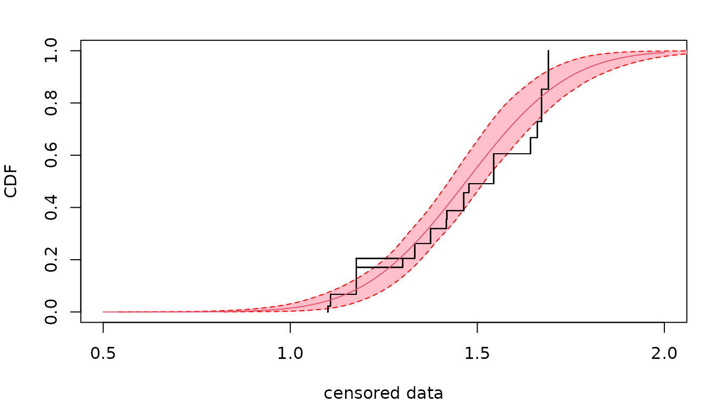

### 4.3. How can we compute confidence intervals on any function of the parameters of the fitted distribution ?

The bootstrap sample of parameter estimates can be used to calculate a
bootstrap sample of any variable defined as a function of the parameters
of the fitted distribution. From such a bootstrap sample you can easily
compute a conidence interval using percentiles. Below is an example that
uses the bootstrap sample of parameters from the previous example (FAQ
4.2) to calculate a 95 percent confidence interval on the Potentially
Affected Portion (PAF) of species at a given exposure to salinity (fixed
to 1.2 in log10 in this example).

``` r
exposure <- 1.2
# Bootstrap sample of the PAF at this exposure
PAF <- pnorm(exposure, mean = bootsample$estim$mean, sd = bootsample$estim$sd)
# confidence interval from 2.5 and 97.5 percentiles
quantile(PAF, probs = c(0.025, 0.975))
```

    ##   2.5%  97.5% 
    ## 0.0599 0.1667

For more complex calculations especially to tranfer uncertainty within a
quantitative risk assessment, we recommend the use of the package `mc2d`
which aims at making such calculations easy and which gives extensive
examples of use of such bootstrap samples of parameters estimated using
functions of the package `fitdistrplus`.

### 4.4. How do we choose the bootstrap number?

Generally, we do not need to choose a number of bootstrap values as high
as the original sample size. We search a number for which the mean and
the standard values become stable. In the log-normal example below, it
is enough to have 100 bootstrap values.

``` r
f.ln.MME <- fitdist(rlnorm(1000), "lnorm", method = "mme", order = 1:2)
# Bootstrap 
b.ln.50 <- bootdist(f.ln.MME, niter = 50)
b.ln.100 <- bootdist(f.ln.MME, niter = 100)
b.ln.200 <- bootdist(f.ln.MME, niter = 200)
b.ln.500 <- bootdist(f.ln.MME, niter = 500)

d1 <- density(b.ln.50, b.ln.100, b.ln.200, b.ln.500)
plot(d1)
```


## 5. How to personalize plots

### 5.1. Can I personalize the default plot given for an object of class `fitdist` or `fitdistcens`?

The default plot given by using the
[`plot()`](https://rdrr.io/r/graphics/plot.default.html) function on an
object of class `fitdist` or `fitdistcens` is hard to personalize.
Indeed this plot was designed only to give a quick overview of the fit,
not to be used as a graph in a manuscript or a formal presentation. To
personalize some of (or all) the goodness-of-fit plots, you should
rather use specific graphical functions, `denscomp`, `cdfcomp`,
`ppcomp`, `qqcomp` or `cdfcompcens` (see how in the following
paragraphs).

### 5.2. How to personalize goodness-of-fit plots ?

The default plot of an object of class `fitdist` can be easily
reproduced and personalized using `denscomp`, `cdfcomp`, `ppcomp` and
`qqcomp`.

``` r
data(groundbeef)
serving <- groundbeef$serving
fit <- fitdist(serving, "gamma")
par(mfrow = c(2,2), mar = c(4, 4, 1, 1))
denscomp(fit, addlegend = FALSE, main = "", xlab = "serving sizes (g)", 
         fitcol = "orange")
qqcomp(fit, addlegend = FALSE, main = "", fitpch = 16, fitcol = "grey", 
       line01lty = 2)
cdfcomp(fit, addlegend = FALSE, main = "", xlab = "serving sizes (g)", 
        fitcol = "orange", lines01 = TRUE)
ppcomp(fit, addlegend = FALSE, main = "", fitpch = 16, fitcol = "grey", 
       line01lty = 2)
```


In a similar way, the default plot of an object of class `fitdistcens`
can be easily personalized using `cdfcompcens`.

### 5.3. Is it possible to obtain `ggplot2` plots ?

An argument `plotstyle` was added to functions `denscomp`, `cdfcomp`,
`ppcomp`, `qqcomp`and `cdfcompcens`, `ppcompcens`, `qqcompcens` to
enable the generation of plots using the `ggplot2` package. This
argument by default fixed at `graphics` must simply be fixed at `ggplot`
for this purpose, as in the following example. In that latter case the
graphical functions return a graphic object that can be further
personalized using `ggplot2` functions.

``` r
require("ggplot2")
```

    ## Loading required package: ggplot2

``` r
fitW <- fitdist(serving, "weibull")
fitln <- fitdist(serving, "lnorm")
fitg <- fitdist(serving, "gamma")
dcomp <- denscomp(list(fitW, fitln, fitg), legendtext = c("Weibull", "lognormal", "gamma"),
    xlab = "serving sizes (g)", xlim = c(0, 250), 
    fitcol = c("red", "green", "orange"), fitlty = 1, fitlwd = 1:3, 
    xlegend = "topright", plotstyle = "ggplot", addlegend = FALSE)
dcomp + ggplot2::theme_minimal() + ggplot2::ggtitle("Ground beef fits")
```


### 5.4. Is it possible to add the names of the observations in a goodness-of-fit plot, e.g. the names of the species in the plot of the Species Sensitivity Distribution (SSD) classically used in ecotoxicology ?

An argument named `name.points` can be used in functions `cdfcomp` or
`CIcdfcomp` to pass a label vector for observed points so as to add the
names of the points on the left of each point. This option is available
only for ECDF goodness-of-fit plots and only for non censored data. This
option can be used as below, for example, to name the species in the
classical plot of the Species Sensitivity Distributions (SSD) in
ecotoxicology.

``` r
data(endosulfan)
ATV <- subset(endosulfan, group == "NonArthroInvert")$ATV
taxaATV <- subset(endosulfan, group == "NonArthroInvert")$taxa
f <- fitdist(ATV, "lnorm")
cdfcomp(f, xlogscale = TRUE, main = "Species Sensitivty Distribution", 
    xlim = c(1, 100000), name.points = taxaATV, 
    addlegend = FALSE, plotstyle = "ggplot")
```

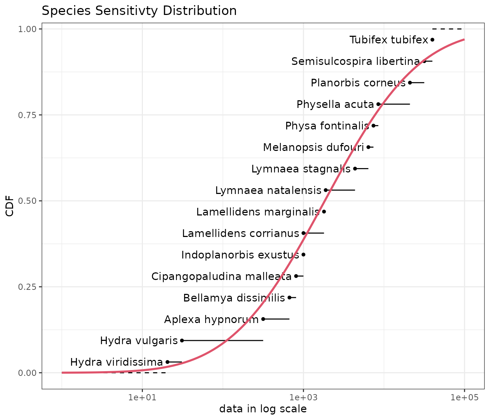

## 6. Questions regarding (left, right and/or interval) censored data

### 6.1. How to code censored data in `fitdistrplus` ?

Censored data must be rpresented in the package by a dataframe of two
columns respectively named left and right, describing each observed
value as an interval. The left column contains either `NA` for left
censored observations, the left bound of the interval for interval
censored observations, or the observed value for non-censored
observations. The right column contains either `NA` for right censored
observations, the right bound of the interval for interval censored
observations, or the observed value for non-censored observations. This
type of representation corresponds to the coding names `"interval2"` in
function `Surv` of the package `survival`. There is no other way to
represent censored data in `fitdistrplus` but the function
[`Surv2fitdistcens()`](https://lbbe-software.github.io/fitdistrplus/reference/Surv2fitdistcens.md)
can be used to help you to format data for use in
[`fitdistcens()`](https://lbbe-software.github.io/fitdistrplus/reference/fitdistcens.md)
from one of the format used in the survival package (see the help page
of
[`Surv2fitdistcens()`](https://lbbe-software.github.io/fitdistrplus/reference/Surv2fitdistcens.md)).
You have a toy example below.

``` r
dtoy <- data.frame(left = c(NA, 2, 4, 6, 9.7, 10), right = c(1, 3, 7, 8, 9.7, NA))
dtoy
```

    ##   left right
    ## 1   NA   1.0
    ## 2  2.0   3.0
    ## 3  4.0   7.0
    ## 4  6.0   8.0
    ## 5  9.7   9.7
    ## 6 10.0    NA

### 6.2. How do I prepare the input of `fitdistcens()` with `Surv2fitdistcens()`?

Let us consider a classical right-censored dataset for human life:
twenty values randomly chosen from the `canlifins` dataset of
`CASdatasets` package. We refer to the help of
[`Surv2fitdistcens()`](https://lbbe-software.github.io/fitdistrplus/reference/Surv2fitdistcens.md)
for other censoring types.

``` r
exitage <- c(81.1,78.9,72.6,67.9,60.1,78.3,83.4,66.9,74.8,80.5,75.6,67.1,
             75.3,82.8,70.1,85.4,74,70,71.6,76.5)
death <- c(0,0,1,0,0,0,0,1,0,0,0,0,0,0,1,1,0,0,0,0)
```

When performing survival analysis, it is very common to use
[`Surv()`](https://rdrr.io/pkg/survival/man/Surv.html) function from
package `survival` to handle different types of censoring. In order to
ease the use of
[`fitdistcens()`](https://lbbe-software.github.io/fitdistrplus/reference/fitdistcens.md),
a dedicated function
[`Surv2fitdistcens()`](https://lbbe-software.github.io/fitdistrplus/reference/Surv2fitdistcens.md)
has been implemented with arguments similar to the ones of
[`Surv()`](https://rdrr.io/pkg/survival/man/Surv.html).

``` r
svdata <- Surv2fitdistcens(exitage, event=death)
```

Let us now fit two simple distributions.

``` r
flnormc <- fitdistcens(svdata, "lnorm")
fweic <- fitdistcens(svdata, "weibull")
par(mfrow=c(1,1), mar=c(4,4,2,1))
cdfcompcens(list(fweic, flnormc), xlim=range(exitage), xlegend = "topleft")
```


### 6.3. How to represent an empirical distribution from censored data ?

The representation of an empirical distribution from censored data is
not a trivial problem. One can simply represent each observation as an
interval at an y-value defined by the rank of the observation as done
below using function `plotdistcens`. This representation can be
interesting to visualize the raw data, but it remains difficult to
correctly order the observations in any case (see the example below on
the right using data `smokedfish`).

``` r
par(mfrow = c(1,2), mar = c(3, 4, 3, 0.5))
plotdistcens(dtoy, NPMLE = FALSE)
data(smokedfish)
dsmo <-  log10(smokedfish)
plotdistcens(dsmo, NPMLE = FALSE)
```


Many authors worked on the development of algorithms for **non
parametric maximum likelihood estimation (NPMLE)** of the **empirical
cumulative distribution function (ECDF)** from interval censored data
(including left and right censored data that can be considered as
interval censored data with one bound at infinity). In old versions of
`fitdistrplus` we used the Turnbull algorithm using calls to functions
of the package `survival`. Even if this Turnbull algorithm is still
available in the package, the default plot now uses the function
`npsurv` of the package `npsurv`. This package provides more performant
algorithms developped by Yong Wang (see references cited in the help
page of `plotdistcens`). Due to lack of maintenance of this package we
were forced to rewrite their main functions in our package, using
another optimization function. The same ECDF plot was also implemented
in our using the Turnbull algorithm of survival (see below).

``` r
par(mfrow = c(2, 2),  mar = c(3, 4, 3, 0.5))
# Turnbull algorithm with representation of middle points of equivalence classes
plotdistcens(dsmo, NPMLE.method = "Turnbull.middlepoints", xlim = c(-1.8, 2.4))
# Turnbull algorithm with representation of equivalence classes as intervals
plotdistcens(dsmo, NPMLE.method = "Turnbull.intervals")
# Wang algorithm with representation of equivalence classes as intervals
plotdistcens(dsmo, NPMLE.method = "Wang")
```

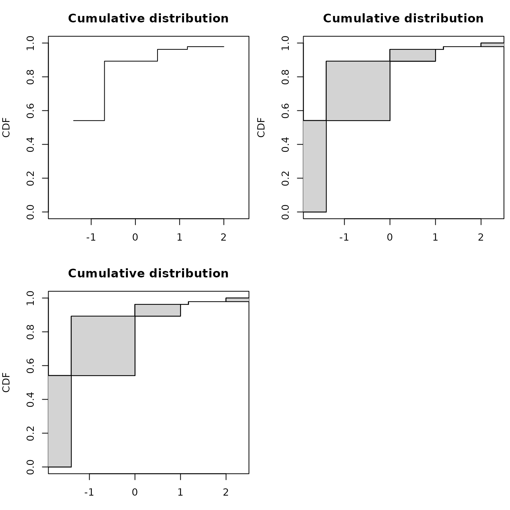

As you can see in the above example, the new implementation of NPMLE
provides a different type of plot for the ECDF, representing by filled
rectangles the zones of non-uniqueness of the NPMLE ECDF. Indeed an
NPMLE algorithm generally proceeds in two steps.

1.  The first step aims at identifying **equivalence classes** (also
    named in the litterture **Turnbull intervals** or **maximal
    intersection intervals** or **innermost intervals** or **maximal
    cliques** of the data). Equivalences classess are points/intervals
    under which the NPMLE ECDF may change. Equivalence classes have been
    shown to correspond to regions between a left bound of an interval
    (named L in the following plot on a the previous toy example)
    immediately followed by a right bound of an interval (named R in the
    following plot). An equivalence class may be of null length (for
    example at each non censored value).

2.  The second step aims at assigning a **probability mass** to each
    equivalence class, which may be zero on some classes. The NPMLE is
    unique only up to these equivalence classes and this **non
    uniqueness** of the NPMLE ECDF is represented by **filled
    rectangles**.

Various NPMLE algorithms are implemented in the packages **Icens**,
**interval** and **npsurv**. They are more or less performant and all of
them do not enable the handling of other data than survival data,
especially with left censored observations.


### 6.4. How to assess the goodness-of-fit of a distribution fitted on censored data ?

The only available method in `fitdistrplus` to fit distributions on
censored data is the maximum likelihood estimation (MLE). Once a
distribution is fitted using `fitdistcens`, AIC and BIC values can be
found in the `summary` of the object of class `fitdistcens` returned by
the function. Those values can be used to compare the fit of various
distributions on a same dataset. Function `gofstat` is not yet proposed
in our package for fits on censored data but we plan to develop it in
the future with the calculation of other goodness-of-fit statistics for
censored data.

``` r
fnorm <- fitdistcens(dsmo,"norm")
flogis <- fitdistcens(dsmo,"logis")
# comparison of AIC values
summary(fnorm)$aic
```

    ## [1] 178

``` r
summary(flogis)$aic
```

    ## [1] 177

Considering goodness-of-fit plots, the generic `plot` function of an
object of class `fitdistcens`provides three plots, one in CDF using the
NPMLE ECDF plot (by default using the Wang prepresentation, see previous
part for details), a Q-Q plot and a P-P plot simply derived from the
Wang plot of the ECDF, with filled rectangles indicating non uniqueness
of the NPMLE ECDF.

``` r
par(mar = c(2, 4, 3, 0.5))
plot(fnorm)
```

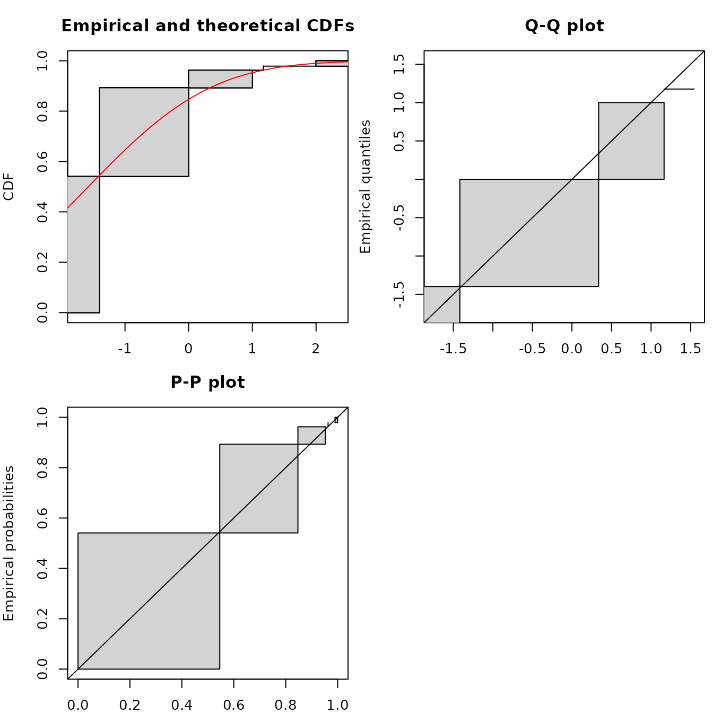

Functions
[`cdfcompcens()`](https://lbbe-software.github.io/fitdistrplus/reference/graphcompcens.md),
`qqcompens()` and
[`ppcompcens()`](https://lbbe-software.github.io/fitdistrplus/reference/graphcompcens.md)
can be used to individualize and personnalize CDF, Q-Q and P-P
goodness-of-fit plots and/or to compare the fit of various distributions
on a same dataset.

``` r
par(mfrow=c(1,1), mar=c(4,4,2,1))
cdfcompcens(list(fnorm, flogis), fitlty = 1)
```


``` r
qqcompcens(list(fnorm, flogis))
```

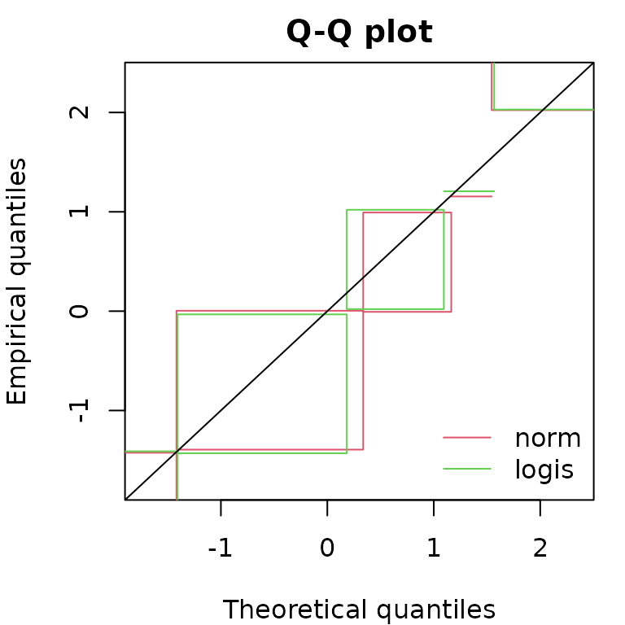

``` r
ppcompcens(list(fnorm, flogis))
```

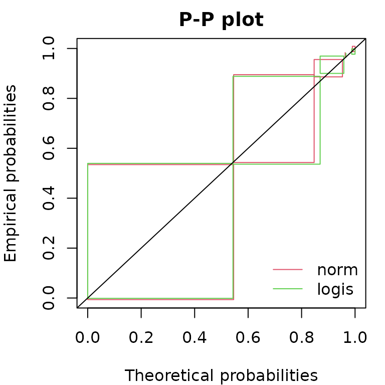

Considering Q-Q plots and P-P plots, it may be easier to compare various
fits by splitting the plots as below which is done automatically using
the `plotstyle` `ggplot` in `qqcompens()` and
[`ppcompcens()`](https://lbbe-software.github.io/fitdistrplus/reference/graphcompcens.md)
but can also be done manually with the `plotstyle` `graphics`.

``` r
qqcompcens(list(fnorm, flogis), lwd = 2, plotstyle = "ggplot",
  fitcol = c("red", "green"), fillrect = c("pink", "lightgreen"),
  legendtext = c("normal distribution", "logistic distribution"))
```


