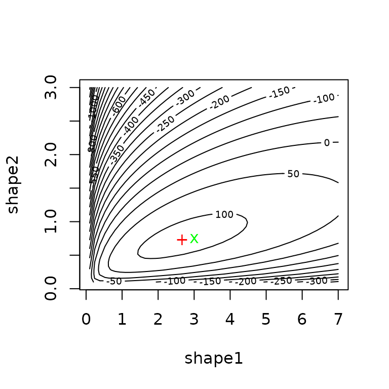
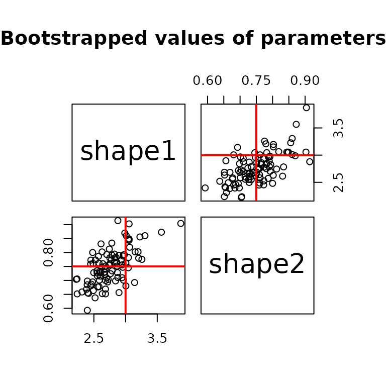
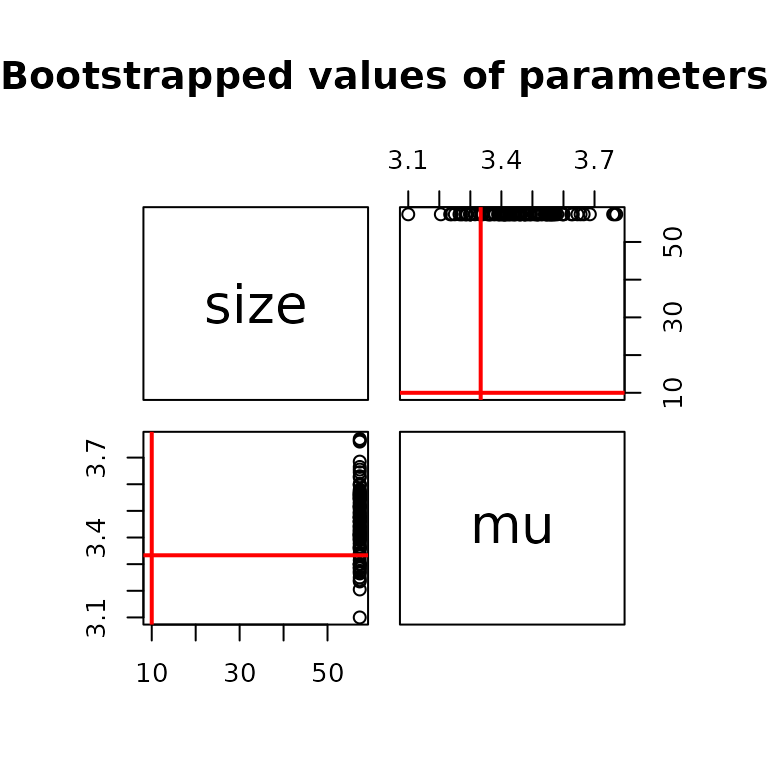

# Which optimization algorithm to choose?

## 1. Quick overview of main optimization methods

We present very quickly the main optimization methods. Please refer to
**Numerical Optimization (Nocedal & Wright, 2006)** or **Numerical
Optimization: theoretical and practical aspects (Bonnans, Gilbert,
Lemarechal & Sagastizabal, 2006)** for a good introduction. We consider
the following problem $\min_{x}f(x)$ for $x \in {\mathbb{R}}^{n}$.

### 1.1. Derivative-free optimization methods

The Nelder-Mead method is one of the most well known derivative-free
methods that use only values of $f$ to search for the minimum. It
consists in building a simplex of $n + 1$ points and moving/shrinking
this simplex into the good direction.

1.  set initial points $x_{1},\ldots,x_{n + 1}$.
2.  order points such that
    $f\left( x_{1} \right) \leq f\left( x_{2} \right) \leq \ldots \leq f\left( x_{n + 1} \right)$.
3.  compute $x_{o}$ as the centroid of $x_{1},\ldots,x_{n}$.
4.  Reflection:
    - compute the reflected point
      $x_{r} = x_{o} + \alpha\left( x_{o} - x_{n + 1} \right)$.
    - **if**
      $f\left( x_{1} \right) \leq f\left( x_{r} \right) < f\left( x_{n} \right)$,
      then replace $x_{n + 1}$ by $x_{r}$, go to step 2.
    - **else** go step 5.
5.  Expansion:
    - **if** $f\left( x_{r} \right) < f\left( x_{1} \right)$, then
      compute the expansion point
      $x_{e} = x_{o} + \gamma\left( x_{o} - x_{n + 1} \right)$.
    - **if** $f\left( x_{e} \right) < f\left( x_{r} \right)$, then
      replace $x_{n + 1}$ by $x_{e}$, go to step 2.
    - **else** $x_{n + 1}$ by $x_{r}$, go to step 2.
    - **else** go to step 6.
6.  Contraction:
    - compute the contracted point
      $x_{c} = x_{o} + \beta\left( x_{o} - x_{n + 1} \right)$.
    - **if** $f\left( x_{c} \right) < f\left( x_{n + 1} \right)$, then
      replace $x_{n + 1}$ by $x_{c}$, go to step 2.  
    - **else** go step 7.
7.  Reduction:
    - for $i = 2,\ldots,n + 1$, compute
      $x_{i} = x_{1} + \sigma\left( x_{i} - x_{1} \right)$.

The Nelder-Mead method is available in `optim`. By default, in `optim`,
$\alpha = 1$, $\beta = 1/2$, $\gamma = 2$ and $\sigma = 1/2$.

### 1.2. Hessian-free optimization methods

For smooth non-linear function, the following method is generally used:
a local method combined with line search work on the scheme
$x_{k + 1} = x_{k} + t_{k}d_{k}$, where the local method will specify
the direction $d_{k}$ and the line search will specify the step size
$t_{k} \in {\mathbb{R}}$.

#### 1.2.1. Computing the direction $d_{k}$

A desirable property for $d_{k}$ is that $d_{k}$ ensures a descent
$f\left( x_{k + 1} \right) < f\left( x_{k} \right)$. Newton methods are
such that $d_{k}$ minimizes a local quadratic approximation of $f$ based
on a Taylor expansion, that is
$q_{f}(d) = f\left( x_{k} \right) + g\left( x_{k} \right)^{T}d + \frac{1}{2}d^{T}H\left( x_{k} \right)d$
where $g$ denotes the gradient and $H$ denotes the Hessian.

The consists in using the exact solution of local minimization problem
$d_{k} = - H\left( x_{k} \right)^{- 1}g\left( x_{k} \right)$.  
In practice, other methods are preferred (at least to ensure positive
definiteness). The method approximates the Hessian by a matrix $H_{k}$
as a function of $H_{k - 1}$, $x_{k}$, $f\left( x_{k} \right)$ and then
$d_{k}$ solves the system $H_{k}d = - g\left( x_{k} \right)$. Some
implementation may also directly approximate the inverse of the Hessian
$W_{k}$ in order to compute $d_{k} = - W_{k}g\left( x_{k} \right)$.
Using the Sherman-Morrison-Woodbury formula, we can switch between
$W_{k}$ and $H_{k}$.

To determine $W_{k}$, first it must verify the secant equation
$H_{k}y_{k} = s_{k}$ or $y_{k} = W_{k}s_{k}$ where
$y_{k} = g_{k + 1} - g_{k}$ and $s_{k} = x_{k + 1} - x_{k}$. To define
the $n(n - 1)$ terms, we generally impose a symmetry and a minimum
distance conditions. We say we have a rank 2 update if
$H_{k} = H_{k - 1} + auu^{T} + bvv^{T}$ and a rank 1 update if \$H_k =
H\_{k-1} + a u u^T \$. Rank $n$ update is justified by the spectral
decomposition theorem.

There are two rank-2 updates which are symmetric and preserve positive
definiteness

- DFP minimizes $\min{||}H - H_{k}{||}_{F}$ such that $H = H^{T}$:
  $$\left. H_{k + 1} = \left( I - \frac{y_{k}s_{k}^{T}}{y_{k}^{T}s_{k}} \right)H_{k}\left( I - \frac{s_{k}y_{k}^{T}}{y_{k}^{T}s_{k}} \right) + \frac{y_{k}y_{k}^{T}}{y_{k}^{T}s_{k}}\Leftrightarrow W_{k + 1} = W_{k} + \frac{s_{k}s_{k}^{T}}{y_{k}^{T}s_{k}} - \frac{W_{k}y_{k}y_{k}^{T}W_{k}^{T}}{y_{k}^{T}W_{k}y_{k}}. \right.$$  
- BFGS minimizes $\min{||}W - W_{k}{||}_{F}$ such that $W = W^{T}$:
  $$\left. H_{k + 1} = H_{k} - \frac{H_{k}y_{k}y_{k}^{T}H_{k}}{y_{k}^{T}H_{k}y_{k}} + \frac{s_{k}s_{k}^{T}}{y_{k}^{T}s_{k}}\Leftrightarrow W_{k + 1} = \left( I - \frac{y_{k}s_{k}^{T}}{y_{k}^{T}s_{k}} \right)^{T}W_{k}\left( I - \frac{y_{k}s_{k}^{T}}{y_{k}^{T}s_{k}} \right) + \frac{s_{k}s_{k}^{T}}{y_{k}^{T}s_{k}}. \right.$$

In `R`, the so-called BFGS scheme is implemented in `optim`.

Another possible method (which is initially arised from quadratic
problems) is the nonlinear conjugate gradients. This consists in
computing directions $\left( d_{0},\ldots,d_{k} \right)$ that are
conjugate with respect to a matrix close to the true Hessian
$H\left( x_{k} \right)$. Directions are computed iteratively by
$d_{k} = - g\left( x_{k} \right) + \beta_{k}d_{k - 1}$ for $k > 1$, once
initiated by $d_{1} = - g\left( x_{1} \right)$. $\beta_{k}$ are updated
according a scheme:

- $\beta_{k} = \frac{g_{k}^{T}g_{k}}{g_{k - 1}^{T}g_{k - 1}}$:
  Fletcher-Reeves update,
- $\beta_{k} = \frac{g_{k}^{T}\left( g_{k} - g_{k - 1} \right)}{g_{k - 1}^{T}g_{k - 1}}$:
  Polak-Ribiere update.

There exists also three-term formula for computing direction
$d_{k} = - g\left( x_{k} \right) + \beta_{k}d_{k - 1} + \gamma_{k}d_{t}$
for $t < k$. A possible scheme is the Beale-Sorenson update defined as
$\beta_{k} = \frac{g_{k}^{T}\left( g_{k} - g_{k - 1} \right)}{d_{k - 1}^{T}\left( g_{k} - g_{k - 1} \right)}$
and
$\gamma_{k} = \frac{g_{k}^{T}\left( g_{t + 1} - g_{t} \right)}{d_{t}^{T}\left( g_{t + 1} - g_{t} \right)}$
if $k > t + 1$ otherwise $\gamma_{k} = 0$ if $k = t$. See Yuan (2006)
for other well-known schemes such as Hestenses-Stiefel, Dixon or
Conjugate-Descent. The three updates (Fletcher-Reeves, Polak-Ribiere,
Beale-Sorenson) of the (non-linear) conjugate gradient are available in
`optim`.

#### 1.2.2. Computing the stepsize $t_{k}$

Let $\phi_{k}(t) = f\left( x_{k} + td_{k} \right)$ for a given
direction/iterate $\left( d_{k},x_{k} \right)$. We need to find
conditions to find a satisfactory stepsize $t_{k}$. In literature, we
consider the descent condition: $\phi_{k}\prime(0) < 0$ and the Armijo
condition: $\phi_{k}(t) \leq \phi_{k}(0) + tc_{1}\phi_{k}\prime(0)$
ensures a decrease of $f$. Nocedal & Wright (2006) presents a
backtracking (or geometric) approach satisfying the Armijo condition and
minimal condition, i.e. Goldstein and Price condition.

- set $t_{k,0}$ e.g. 1, $0 < \alpha < 1$,
- **Repeat** until Armijo satisfied,
  - $t_{k,i + 1} = \alpha \times t_{k,i}$.
- **end Repeat**

This backtracking linesearch is available in `optim`.

### 1.3. Benchmark

To simplify the benchmark of optimization methods, we create a
`fitbench` function that computes the desired estimation method for all
optimization methods. This function is currently not exported in the
package.

``` r
fitbench <- function(data, distr, method, grad = NULL, 
                     control = list(trace = 0, REPORT = 1, maxit = 1000), 
                     lower = -Inf, upper = +Inf, ...) 
```

## 2. Numerical illustration with the beta distribution

### 2.1. Log-likelihood function and its gradient for beta distribution

#### 2.1.1. Theoretical value

The density of the beta distribution is given by
$$f\left( x;\delta_{1},\delta_{2} \right) = \frac{x^{\delta_{1} - 1}(1 - x)^{\delta_{2} - 1}}{\beta\left( \delta_{1},\delta_{2} \right)},$$
where $\beta$ denotes the beta function, see the NIST Handbook of
mathematical functions <https://dlmf.nist.gov/>. We recall that
$\beta(a,b) = \Gamma(a)\Gamma(b)/\Gamma(a + b)$. There the
log-likelihood for a set of observations
$\left( x_{1},\ldots,x_{n} \right)$ is
$$\log L\left( \delta_{1},\delta_{2} \right) = \left( \delta_{1} - 1 \right)\sum\limits_{i = 1}^{n}\log\left( x_{i} \right) + \left( \delta_{2} - 1 \right)\sum\limits_{i = 1}^{n}\log\left( 1 - x_{i} \right) + n\log\left( \beta\left( \delta_{1},\delta_{2} \right) \right)$$
The gradient with respect to $a$ and $b$ is
$$\nabla\log L\left( \delta_{1},\delta_{2} \right) = \begin{pmatrix}
{\sum\limits_{i = 1}^{n}\ln\left( x_{i} \right) - n\psi\left( \delta_{1} \right) + n\psi\left( \delta_{1} + \delta_{2} \right)} \\
{\sum\limits_{i = 1}^{n}\ln\left( 1 - x_{i} \right) - n\psi\left( \delta_{2} \right) + n\psi\left( \delta_{1} + \delta_{2} \right)}
\end{pmatrix},$$ where $\psi(x) = \Gamma\prime(x)/\Gamma(x)$ is the
digamma function, see the NIST Handbook of mathematical functions
<https://dlmf.nist.gov/>.

#### 2.1.2. `R` implementation

As in the `fitdistrplus` package, we minimize the opposite of the
log-likelihood: we implement the opposite of the gradient in `grlnL`.
Both the log-likelihood and its gradient are not exported.

``` r
lnL <- function(par, fix.arg, obs, ddistnam) 
  fitdistrplus:::loglikelihood(par, fix.arg, obs, ddistnam) 
grlnlbeta <- fitdistrplus:::grlnlbeta
```

### 2.2. Random generation of a sample

``` r
#(1) beta distribution
n <- 200
x <- rbeta(n, 3, 3/4)
grlnlbeta(c(3, 4), x) #test
```

    ## [1] -133  317

``` r
hist(x, prob=TRUE, xlim=0:1)
lines(density(x), col="red")
curve(dbeta(x, 3, 3/4), col="green", add=TRUE)
legend("topleft", lty=1, col=c("red","green"), legend=c("empirical", "theoretical"), bty="n")
```


### 2.3 Fit Beta distribution

Define control parameters.

``` r
ctr <- list(trace=0, REPORT=1, maxit=1000)
```

Call `mledist` with the default optimization function (`optim`
implemented in `stats` package) with and without the gradient for the
different optimization methods.

``` r
unconstropt <- fitbench(x, "beta", "mle", grad=grlnlbeta, lower=0)
```

    ##     BFGS       NM     CGFR     CGPR     CGBS L-BFGS-B     NM-B   G-BFGS 
    ##       14       14       14       14       14       14       14       14 
    ##   G-CGFR   G-CGPR   G-CGBS G-BFGS-B   G-NM-B G-CGFR-B G-CGPR-B G-CGBS-B 
    ##       14       14       14       14       14       14       14       14

In the case of constrained optimization, `mledist` permits the direct
use of `constrOptim` function (still implemented in `stats` package)
that allow linear inequality constraints by using a logarithmic barrier.

Use a exp/log transformation of the shape parameters $\delta_{1}$ and
$\delta_{2}$ to ensure that the shape parameters are strictly positive.

``` r
dbeta2 <- function(x, shape1, shape2, log)
  dbeta(x, exp(shape1), exp(shape2), log=log)
#take the log of the starting values
startarg <- lapply(fitdistrplus:::startargdefault(x, "beta"), log)
#redefine the gradient for the new parametrization
grbetaexp <- function(par, obs, ...) 
    grlnlbeta(exp(par), obs) * exp(par)
    

expopt <- fitbench(x, distr="beta2", method="mle", grad=grbetaexp, start=startarg) 
```

    ##   BFGS     NM   CGFR   CGPR   CGBS G-BFGS G-CGFR G-CGPR G-CGBS 
    ##     14     14     14     14     14     14     14     14     14

``` r
#get back to original parametrization
expopt[c("fitted shape1", "fitted shape2"), ] <- exp(expopt[c("fitted shape1", "fitted shape2"), ])
```

Then we extract the values of the fitted parameters, the value of the
corresponding log-likelihood and the number of counts to the function to
minimize and its gradient (whether it is the theoretical gradient or the
numerically approximated one).

### 2.4. Results of the numerical investigation

Results are displayed in the following tables: (1) the original
parametrization without specifying the gradient (`-B` stands for bounded
version), (2) the original parametrization with the (true) gradient
(`-B` stands for bounded version and `-G` for gradient), (3) the
log-transformed parametrization without specifying the gradient, (4) the
log-transformed parametrization with the (true) gradient (`-G` stands
for gradient).

|                 |    BFGS |      NM |    CGFR |    CGPR |    CGBS | L-BFGS-B |    NM-B |
|:----------------|--------:|--------:|--------:|--------:|--------:|---------:|--------:|
| fitted shape1   |   2.665 |   2.664 |   2.665 |   2.665 |   2.665 |    2.665 |   2.665 |
| fitted shape2   |   0.731 |   0.731 |   0.731 |   0.731 |   0.731 |    0.731 |   0.731 |
| fitted loglik   | 114.165 | 114.165 | 114.165 | 114.165 | 114.165 |  114.165 | 114.165 |
| func. eval. nb. |  15.000 |  47.000 | 191.000 | 221.000 | 242.000 |    8.000 |  92.000 |
| grad. eval. nb. |  11.000 |      NA |  95.000 | 115.000 | 175.000 |    8.000 |      NA |
| time (sec)      |   0.007 |   0.005 |   0.034 |   0.040 |   0.055 |    0.004 |   0.011 |

Unconstrained optimization with approximated gradient

|                 |  G-BFGS |  G-CGFR |  G-CGPR |  G-CGBS | G-BFGS-B |  G-NM-B | G-CGFR-B | G-CGPR-B | G-CGBS-B |
|:----------------|--------:|--------:|--------:|--------:|---------:|--------:|---------:|---------:|---------:|
| fitted shape1   |   2.665 |   2.665 |   2.665 |   2.665 |    2.665 |   2.665 |    2.665 |    2.665 |    2.665 |
| fitted shape2   |   0.731 |   0.731 |   0.731 |   0.731 |    0.731 |   0.731 |    0.731 |    0.731 |    0.731 |
| fitted loglik   | 114.165 | 114.165 | 114.165 | 114.165 |  114.165 | 114.165 |  114.165 |  114.165 |  114.165 |
| func. eval. nb. |  22.000 | 249.000 | 239.000 | 138.000 |   40.000 |  92.000 |  433.000 |  345.000 |  255.000 |
| grad. eval. nb. |   5.000 |  71.000 |  67.000 |  43.000 |    6.000 |      NA |   92.000 |   82.000 |   58.000 |
| time (sec)      |   0.010 |   0.079 |   0.074 |   0.048 |    0.021 |   0.020 |    0.128 |    0.105 |    0.079 |

Unconstrained optimization with true gradient

|                 |    BFGS |      NM |    CGFR |    CGPR |    CGBS |
|:----------------|--------:|--------:|--------:|--------:|--------:|
| fitted shape1   |   2.665 |   2.664 |   2.665 |   2.665 |   2.665 |
| fitted shape2   |   0.731 |   0.731 |   0.731 |   0.731 |   0.731 |
| fitted loglik   | 114.165 | 114.165 | 114.165 | 114.165 | 114.165 |
| func. eval. nb. |   8.000 |  41.000 |  37.000 |  49.000 |  47.000 |
| grad. eval. nb. |   5.000 |      NA |  19.000 |  39.000 |  33.000 |
| time (sec)      |   0.015 |   0.004 |   0.008 |   0.013 |   0.012 |

Exponential trick optimization with approximated gradient

|                 |  G-BFGS |  G-CGFR |  G-CGPR |  G-CGBS |
|:----------------|--------:|--------:|--------:|--------:|
| fitted shape1   |   2.665 |   2.665 |   2.665 |   2.665 |
| fitted shape2   |   0.731 |   0.731 |   0.731 |   0.731 |
| fitted loglik   | 114.165 | 114.165 | 114.165 | 114.165 |
| func. eval. nb. |  21.000 | 109.000 | 146.000 | 112.000 |
| grad. eval. nb. |   5.000 |  29.000 |  47.000 |  35.000 |
| time (sec)      |   0.012 |   0.034 |   0.052 |   0.039 |

Exponential trick optimization with true gradient

Using `llsurface`, we plot the log-likehood surface around the true
value (green) and the fitted parameters (red).

``` r
llsurface(min.arg=c(0.1, 0.1), max.arg=c(7, 3), xlim=c(.1,7), 
          plot.arg=c("shape1", "shape2"), nlev=25,
          lseq=50, data=x, distr="beta", back.col = FALSE)
points(unconstropt[1,"BFGS"], unconstropt[2,"BFGS"], pch="+", col="red")
points(3, 3/4, pch="x", col="green")
```



We can simulate bootstrap replicates using the `bootdist` function.

``` r
b1 <- bootdist(fitdist(x, "beta", method = "mle", optim.method = "BFGS"), 
               niter = 100, parallel = "snow", ncpus = 2)
summary(b1)
```

    ## Parametric bootstrap medians and 95% percentile CI 
    ##        Median  2.5% 97.5%
    ## shape1   2.73 2.272 3.283
    ## shape2   0.75 0.652 0.888

``` r
plot(b1, trueval = c(3, 3/4))
```



## 3. Numerical illustration with the negative binomial distribution

### 3.1. Log-likelihood function and its gradient for negative binomial distribution

#### 3.1.1. Theoretical value

The p.m.f. of the Negative binomial distribution is given by
$$f(x;m,p) = \frac{\Gamma(x + m)}{\Gamma(m)x!}p^{m}(1 - p)^{x},$$ where
$\Gamma$ denotes the beta function, see the NIST Handbook of
mathematical functions <https://dlmf.nist.gov/>. There exists an
alternative representation where $\mu = m(1 - p)/p$ or equivalently
$p = m/(m + \mu)$. Thus, the log-likelihood for a set of observations
$\left( x_{1},\ldots,x_{n} \right)$ is
$$\log L(m,p) = \sum\limits_{i = 1}^{n}\log\Gamma\left( x_{i} + m \right) - n\log\Gamma(m) - \sum\limits_{i = 1}^{n}\log\left( x_{i}! \right) + mn\log(p) + \sum\limits_{i = 1}^{n}x_{i}\log(1 - p)$$
The gradient with respect to $m$ and $p$ is
$$\nabla\log L(m,p) = \begin{pmatrix}
{\sum\limits_{i = 1}^{n}\psi\left( x_{i} + m \right) - n\psi(m) + n\log(p)} \\
{mn/p - \sum\limits_{i = 1}^{n}x_{i}/(1 - p)}
\end{pmatrix},$$ where $\psi(x) = \Gamma\prime(x)/\Gamma(x)$ is the
digamma function, see the NIST Handbook of mathematical functions
<https://dlmf.nist.gov/>.

#### 3.1.2. `R` implementation

As in the `fitdistrplus` package, we minimize the opposite of the
log-likelihood: we implement the opposite of the gradient in `grlnL`.

``` r
grlnlNB <- function(x, obs, ...)
{
  m <- x[1]
  p <- x[2]
  n <- length(obs)
  c(sum(psigamma(obs+m)) - n*psigamma(m) + n*log(p),
    m*n/p - sum(obs)/(1-p))
}
```

### 3.2. Random generation of a sample

``` r
#(2) negative binomial distribution
n <- 200
trueval <- c("size"=10, "prob"=3/4, "mu"=10/3)
x <- rnbinom(n, trueval["size"], trueval["prob"])

hist(x, prob=TRUE, ylim=c(0, .3), xlim=c(0, 10))
lines(density(x), col="red")
points(min(x):max(x), dnbinom(min(x):max(x), trueval["size"], trueval["prob"]), 
       col = "green")
legend("topright", lty = 1, col = c("red", "green"), 
       legend = c("empirical", "theoretical"), bty="n")
```


### 3.3. Fit a negative binomial distribution

Define control parameters and make the benchmark.

``` r
ctr <- list(trace = 0, REPORT = 1, maxit = 1000)
unconstropt <- fitbench(x, "nbinom", "mle", grad = grlnlNB, lower = 0)
```

    ##     BFGS       NM     CGFR     CGPR     CGBS L-BFGS-B     NM-B   G-BFGS 
    ##       14       14       14       14       14       14       14       14 
    ##   G-CGFR   G-CGPR   G-CGBS G-BFGS-B   G-NM-B G-CGFR-B G-CGPR-B G-CGBS-B 
    ##       14       14       14       14       14       14       14       14

``` r
unconstropt <- rbind(unconstropt, 
                     "fitted prob" = unconstropt["fitted mu", ] / (1 + unconstropt["fitted mu", ]))
```

In the case of constrained optimization, `mledist` permits the direct
use of `constrOptim` function (still implemented in `stats` package)
that allow linear inequality constraints by using a logarithmic barrier.

Use a exp/log transformation of the shape parameters $\delta_{1}$ and
$\delta_{2}$ to ensure that the shape parameters are strictly positive.

``` r
dnbinom2 <- function(x, size, prob, log)
  dnbinom(x, exp(size), 1 / (1 + exp(-prob)), log = log)
# transform starting values
startarg <- fitdistrplus:::startargdefault(x, "nbinom")
startarg$mu <- startarg$size / (startarg$size + startarg$mu)
startarg <- list(size = log(startarg[[1]]), 
                 prob = log(startarg[[2]] / (1 - startarg[[2]])))

# redefine the gradient for the new parametrization
Trans <- function(x)
  c(exp(x[1]), plogis(x[2]))
grNBexp <- function(par, obs, ...) 
    grlnlNB(Trans(par), obs) * c(exp(par[1]), plogis(x[2])*(1-plogis(x[2])))

expopt <- fitbench(x, distr="nbinom2", method="mle", grad=grNBexp, start=startarg) 
```

    ##   BFGS     NM   CGFR   CGPR   CGBS G-BFGS G-CGFR G-CGPR G-CGBS 
    ##     14     14     14     14     14     14     14     14     14

``` r
# get back to original parametrization
expopt[c("fitted size", "fitted prob"), ] <- 
  apply(expopt[c("fitted size", "fitted prob"), ], 2, Trans)
```

Then we extract the values of the fitted parameters, the value of the
corresponding log-likelihood and the number of counts to the function to
minimize and its gradient (whether it is the theoretical gradient or the
numerically approximated one).

### 3.4. Results of the numerical investigation

Results are displayed in the following tables: (1) the original
parametrization without specifying the gradient (`-B` stands for bounded
version), (2) the original parametrization with the (true) gradient
(`-B` stands for bounded version and `-G` for gradient), (3) the
log-transformed parametrization without specifying the gradient, (4) the
log-transformed parametrization with the (true) gradient (`-G` stands
for gradient).

|                 |     BFGS |       NM |     CGFR |     CGPR |     CGBS | L-BFGS-B |     NM-B |
|:----------------|---------:|---------:|---------:|---------:|---------:|---------:|---------:|
| fitted size     |   57.333 |   62.504 |   57.337 |   57.335 |   57.335 |   57.333 |   58.446 |
| fitted mu       |    3.440 |    3.440 |    3.440 |    3.440 |    3.440 |    3.440 |    3.440 |
| fitted loglik   | -402.675 | -402.674 | -402.675 | -402.675 | -402.675 | -402.675 | -402.675 |
| func. eval. nb. |    2.000 |   39.000 | 2001.000 | 1001.000 | 1001.000 |    2.000 |    0.000 |
| grad. eval. nb. |    1.000 |       NA | 1001.000 | 1001.000 | 1001.000 |    2.000 |       NA |
| time (sec)      |    0.002 |    0.003 |    0.249 |    0.199 |    0.200 |    0.002 |    0.003 |
| fitted prob     |    0.775 |    0.775 |    0.775 |    0.775 |    0.775 |    0.775 |    0.775 |

Unconstrained optimization with approximated gradient

|                 |   G-BFGS |   G-CGFR |   G-CGPR |   G-CGBS | G-BFGS-B |   G-NM-B | G-CGFR-B | G-CGPR-B | G-CGBS-B |
|:----------------|---------:|---------:|---------:|---------:|---------:|---------:|---------:|---------:|---------:|
| fitted size     |   57.333 |   57.333 |   57.333 |   57.333 |   57.333 |   58.446 |   57.333 |   57.333 |   57.333 |
| fitted mu       |    3.440 |    3.440 |    3.440 |    3.440 |    3.440 |    3.440 |    3.440 |    3.440 |    3.440 |
| fitted loglik   | -402.675 | -402.675 | -402.675 | -402.675 | -402.675 | -402.675 | -402.675 | -402.675 | -402.675 |
| func. eval. nb. |   28.000 |   28.000 |   28.000 |   28.000 |    0.000 |    0.000 |    0.000 |    0.000 |    0.000 |
| grad. eval. nb. |    1.000 |    1.000 |    1.000 |    1.000 |       NA |       NA |       NA |       NA |       NA |
| time (sec)      |    0.009 |    0.002 |    0.002 |    0.002 |    0.002 |    0.003 |    0.002 |    0.002 |    0.002 |
| fitted prob     |    0.775 |    0.775 |    0.775 |    0.775 |    0.775 |    0.775 |    0.775 |    0.775 |    0.775 |

Unconstrained optimization with true gradient

|                 |     BFGS |       NM |     CGFR |     CGPR |     CGBS |
|:----------------|---------:|---------:|---------:|---------:|---------:|
| fitted size     |   57.335 |   62.320 |   58.595 |   60.138 |   60.875 |
| fitted prob     |    0.943 |    0.948 |    0.945 |    0.946 |    0.947 |
| fitted loglik   | -402.675 | -402.674 | -402.675 | -402.674 | -402.674 |
| func. eval. nb. |    3.000 |   45.000 | 2501.000 | 2276.000 | 2272.000 |
| grad. eval. nb. |    1.000 |       NA | 1001.000 | 1001.000 | 1001.000 |
| time (sec)      |    0.005 |    0.003 |    0.269 |    0.261 |    0.263 |

Exponential trick optimization with approximated gradient

|                 |   G-BFGS |   G-CGFR |   G-CGPR |   G-CGBS |
|:----------------|---------:|---------:|---------:|---------:|
| fitted size     |   57.333 |   57.333 |   57.333 |   57.333 |
| fitted prob     |    0.943 |    0.943 |    0.943 |    0.943 |
| fitted loglik   | -402.675 | -402.675 | -402.675 | -402.675 |
| func. eval. nb. |   18.000 |   44.000 |   39.000 |   39.000 |
| grad. eval. nb. |    1.000 |    3.000 |    3.000 |    3.000 |
| time (sec)      |    0.007 |    0.003 |    0.002 |    0.002 |

Exponential trick optimization with true gradient

Using `llsurface`, we plot the log-likehood surface around the true
value (green) and the fitted parameters (red).

``` r
llsurface(min.arg = c(5, 0.3), max.arg = c(15, 1), xlim=c(5, 15),
          plot.arg = c("size", "prob"), nlev = 25,
          lseq = 50, data = x, distr = "nbinom", back.col = FALSE)
points(unconstropt["fitted size", "BFGS"], unconstropt["fitted prob", "BFGS"], 
       pch = "+", col = "red")
points(trueval["size"], trueval["prob"], pch = "x", col = "green")
```


We can simulate bootstrap replicates using the `bootdist` function.

``` r
b1 <- bootdist(fitdist(x, "nbinom", method = "mle", optim.method = "BFGS"), 
               niter = 100, parallel = "snow", ncpus = 2)
summary(b1)
```

    ## Parametric bootstrap medians and 95% percentile CI 
    ##      Median  2.5% 97.5%
    ## size  57.33 57.33 57.33
    ## mu     3.46  3.24  3.72

``` r
plot(b1, trueval=trueval[c("size", "mu")]) 
```



## 4. Conclusion

Based on the two previous examples, we observe that all methods converge
to the same point. This is reassuring.  
However, the number of function evaluations (and the gradient
evaluations) is very different from a method to another. Furthermore,
specifying the true gradient of the log-likelihood does not help at all
the fitting procedure and generally slows down the convergence.
Generally, the best method is the standard BFGS method or the BFGS
method with the exponential transformation of the parameters. Since the
exponential function is differentiable, the asymptotic properties are
still preserved (by the Delta method) but for finite-sample this may
produce a small bias.
